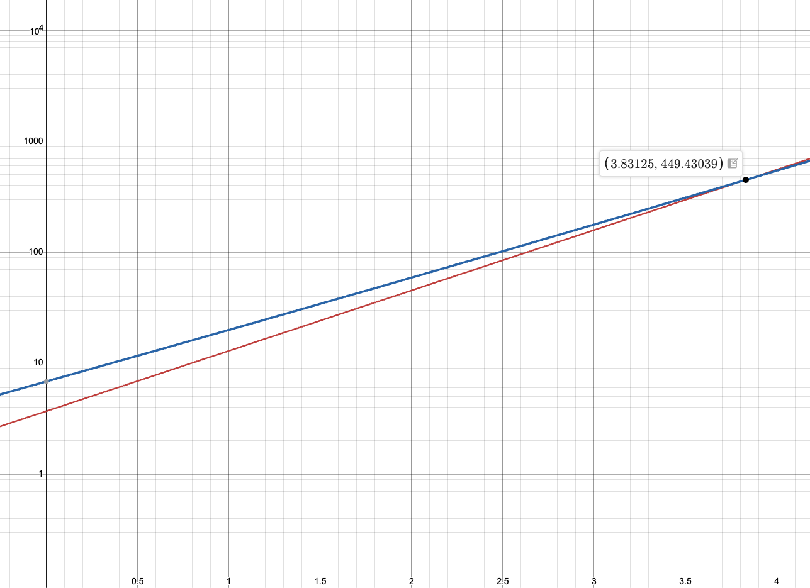

**Bottom line up front:** <i>I suspect that we will see a huge spike in
inference costs due to macro risks, current inference subsidization, and
questionable ROI on average from AI adoption. If inference costs increase, they
will make all but the least powerful models unaffordable for the average person
and enterprise. This will limit the potential for rapid societal and economic
transformation, relegating us to a reality where AI is another tool like email
that usually works well but can't automate most things in its own right. Some
actionable things I believe we can do to lower the probability of this outcome
are:</i> create, research how to make inference cheaper, open source everything,
*and* build community.

 

I work in software, and since the beginning of this year, 2026, I have been
investing in deeply integrating AI into my workflow. AI has gotten strikingly
good at coding, to the point where it writes close to 90% of my code. Many of my
coworkers at Stripe are reporting a similar experience. Claude's latest Opus
model is a significant step above previous frontier iterations, and engineers
across the company have been using it extensively. I am sure this is playing out
across the whole industry as well.

The news isn't all great though. A step up in capability means a step up in
cost. Recently, I caught wind of news that a large software company (name
omitted for privacy) is pumping the brakes on AI spend. The team responsible for
rolling out AI tools must have received a directive to start constraining costs
because the company's bottom line was starting to feel it, and they forced all
engineers to use a lower tier model unknowingly. In response, several engineers
at the company grumbled about how the lower model tier's output was noticeably
worse, and it led to wasted cycles spent on reviewing and correcting the worse
model's output.

This got me thinking about whether the AI adoption and job replacement scenarios
painted in pieces like the
[Citrini report](https://www.citriniresearch.com/p/2028gic) and Matt Schumer's
now infamous
[Something Big Is Happening](https://www.linkedin.com/pulse/something-big-happening-matt-shumer-so5he/)
post are worth believing.

My take is that **the white collar AI replacement narrative might be
overstated**, and I'm disappointed about the reality that is likely to emerge
instead. I'll do my best to explain why.

## Running headfirst into the cost wall

Models with larger parameter counts and larger context windows have been
[shown](https://metr.org/blog/2025-03-19-measuring-ai-ability-to-complete-long-tasks/)[]^(Albeit with benchmarks that I don't think generalize well. Critique of the METR task horizon assessment deserves a post of its own).
to perform significantly better on tasks of longer horizon and complexity, and
you get what you pay for. Today, frontier reasoning capability is affordable
because of venture capital or loss-leader subsidies. The frontier giants of
Anthropic, OpenAI, Google, and Meta are all facing intense competitive pressure
to price their inference at below market rates. This era of below-market pricing
among these will have to come to an end at some point when the market returns to
rationality, just as Uber investors
[subsidized the millennial lifestyle](https://www.nytimes.com/2021/06/08/technology/farewell-millennial-lifestyle-subsidy.html)
for a time before fares skyrocketed.

When that time comes, I contend that, at least in the short-to-medium term,
access to frontier reasoning capabilities will be constrained to the hands of
the rich and powerful few, much like other forms of wealth in our top-heavy
capitalist society. I find this vision of the future to be the most coherent,
and the most boring...which probably means it is likely. The possible lack of
future access to frontier model updates for the long tail of
[unmagnificent](https://www.wealthspire.com/financial-dictionary/magnificent-7-stocks/)
enterprises, coupled with recent findings about the nature of how the current
generation of AI models paradoxically may _decrease_ productivity, or at least
make work more cognitively exhausting, could lead to most people being "stuck"
with their jobs and AI that can fulfill some functions but isn't good enough to
replace jobs entirely. In light of this, I believe an economy-scale disruption
in the vein of the Citrini report isn't very probable, and the status quo will
probably remain in place for some time.

By the end of this post, I hope to reinvigorate in you (and myself, quite
frankly) a revolutionary spirit with some thoughts about what actions we can
take to try to generate escape velocity from this boring future. But to start,
here are the main pillars of my argument:

1. **AI buildout is bottlenecked:** constraints on the manufacturing of critical
   inputs limit the AI buildout.. Recent geopolitical instability and its
   effects on energy prices threaten to further dampen progress.

1. **Inference costs are being held artificially low:** Investor money is
   subsidizing the free tiers of frontier labs, and in some cases frontier labs
   are even losing money on paid tiers. We should expect inference costs to rise
   substantially if the frontier labs providing the models we know and love want
   to stay in business.

1. **AI Adoption and productivity gains may not be sustainable:** Investment in
   AI tools are reportedly not generating ROI for many enterprises. AI is making
   workers *feel* more productive, but with the consequence of increased
   cognitive load.

## AI buildout challenges

When an environment changes, systems operating in that environment either fail
or adapt. The release of ChatGPT in 2022 changed the environment, and 3.5 years
later, our economic system is still in the process of adapting.

How quickly different parts of the economy can adapt is variable. Software
adapts very quickly, hardware, more slowly, and physical manufacturing
infrastructure adapts at a snail's pace. It is not very surprising then, in my
view, that the chokepoints of the AI buildout are in the realm of the physical:
power and silicon.

### Challenge 1: Power

If you're tapped into the sphere of popular tech podcasts, such as the
[Cheeky Pint](https://cheekypint.transistor.fm/) podcast by John Collison,
cofounder of Stripe, you may have heard Elon Musk in a recent episode talking
about a severe shortage of the turbines that are used to convert natural
gas-powered motion into electricity. Gas-fired turbine lead times have
[soared](https://www.spglobal.com/energy/en/news-research/latest-news/electric-power/052025-us-gas-fired-turbine-wait-times-as-much-as-seven-years-costs-up-sharply)
to as much as *seven years*. That means that if you aren't already in the queue,
you're waiting close to a decade to getting just the turbines, which are
necessary but not sufficient to generate electricity from natural gas.

Natural gas turbines are just one example of how bottlenecks in the energy
generation pipeline are emerging. Global supply chain interdependencies, and the
geopolitics that threaten them, also play a role. Recent US military action in
Iran has led to the effective closure of the strait of Hormuz, which is
disrupting global oil and liquefied natural gas (LNG) supply. According to
[Reuters](https://www.reuters.com/business/energy/iran-wars-energy-impact-forces-world-pay-up-cut-consumption-2026-03-21/),
the situation in the strait has removed around 400 million barrels from the
market, "triggering price increases of around 50%." This crisis may be
transient, and we will see how things play out in the coming weeks, but it
highlights the US and world economies' sensitivity to global conflict.

Natural gas may also be more significant to this buildout than we think. In the
previously mentioned Cheeky Pint episode 21, Musk discussed the bottlenecked
state of power production (emphasis mine):

> Yes. You can drill down to a level further. It's the vanes and blades in the
> turbines that are the limiting factor because it’s a very specialized process
> to cast the blades and vanes in the turbines, assuming you’re using gas power.
> **It's very difficult to scale other forms of power.** You can potentially
> scale solar, but the tariffs currently for importing solar in the US are
> gigantic and the domestic solar production is pitiful.

### Challenge 2: Silicon

Another part of the AI buildout with significant supply chain risk is silicon.
TSMC is a Taiwanese corporation which represents a single point of failure for
the US tech industry. In Q2 2025, TSMC
[captured](https://www.design-reuse.com/news/202529294-global-foundry-revenue-surged-to-41-7-billion-in-q2-2025-with-tsmc-capturing-a-record-70-percent-market-share/)
a record 70.2% of chip foundry market share. According to
[Nasdaq](https://www.nasdaq.com/articles/1-number-may-ensure-tsmcs-market-dominance),
TSMC has an even higher share, 90%, of advanced chip manufacturing, which
includes 3-nanometer chips which are becoming standard. They are clearly very
good at what they do, and according to Reiner Pope, founder of chip startup
[MatX](https://matx.com/), in his
[interview](https://cheekypint.substack.com/p/reiner-pope-of-matx-on-accelerating)
on the Cheeky Pint podcast, TSMC is relatively cheap for the work they do, and
they maintain good customer relationships. TSMC has become a global giant
through business acumen and successful R&D efforts to develop robust
manufacturing processes. The elephant in the room remains, however: Taiwan is a
mere 100 miles off the coast of China, posing an inescapable geopolitical risk.

Under pressure from the US government, TSMC has worked to spin up a fab in
Arizona. Morris Chang, legend of the semiconductor industry and founder of TSMC,
has [said](https://newsletter.semianalysis.com/p/tsmc-overseas-fabs-a-success)
that he thinks TSMC Arizona will be non-competitive in the global market. There
may be some weight to this claim, as TSMC Arizona already lags behind Taiwan in
the set of manufacturing processes that are available. TSMC is currently capable
of lithography down to 2 nanometer scale, and cloud service providers are
[rushing](https://www.trendforce.com/news/2025/06/02/news-tsmcs-2nm-wafers-rumored-to-soar-to-30k-per-unit-yet-csp-giants-reportedly-rush-to-adopt-by-2027/)
to adopt it, but 2nm and the older 3nm processes are slated to be made available
in the Arizona plant in 2029 and 2027, respectively. In Taiwan, a 1nm fab is
[already set](https://www.trendforce.com/news/2025/02/03/news-tsmc-said-to-plan-2nm-production-in-u-s-1nm-fab-in-tainan/)
for Tainan. Current headlines about manufacturing in Arizona of advanced silicon
dies for frontier chip designers such as NVIDIA are deceiving too, because the
[advanced packaging](https://www.trendforce.com/news/2025/06/10/news-tsmc-speeds-up-arizona-expansion-yet-u-s-packaging-plant-sites-reportedly-remain-up-in-the-air/)
processes still need to be done in Taiwan, although there are plans to build
advanced packaging plants in the same Arizona-based facility.

Eventually though, I expect the manufacturing capability gap will be closed, but
the gaps of capacity and cost remain. In 2025, TSMC production exceeded 17
million 12-inch equivalent wafers, which is 1.4 million per month. According to
a report in early 2025, the Arizona 4nm fab is expected to reach a capacity of
30,000 wafers per month, which is just 360,000 per year, and TSMC Arizona
operations are reportedly
[30% more expensive](https://www.techpowerup.com/330349/tsmc-arizona-plant-operations-will-reportedly-cost-30-more-than-taiwan-sites?cp=2),
and the Arizona plant still reportedly needs to
[import materials from Taiwan](https://www.techpowerup.com/330349/tsmc-arizona-plant-operations-will-reportedly-cost-30-more-than-taiwan-sites?cp=2)
to maintain production quality.

### Putting this all together

It seems that more push is needed from the US government to subsidize chip costs
(perhaps with tariff revenue?) to spur US-based demand, or to provide research
grant funding to incentivize silicon die manufacturing process R&D on US soil,
either with TSMC or other companies or universities, so that process
improvements and manufacturing capacity hit US soil first.

If we don't take action, we are at best poised to experience severe supply
shortage of frontier-level chips, leading to significantly increased inference
costs, and at worst, positioned to lose the AI race entirely to other
governments that are willing to take bolder steps, such as China's CCP. In
either scenario, frontier-level inference would be relegated to the rich buyers
who can afford it. In addition to macro risk, there is also the simple financial
reality that AI inference is mispriced relative to how much it costs, as I'll go
over in the next section.

## Inference costs are artificially low

As a business model, serving AI inference is more akin to a utility business
than a traditional SaaS business. While both OpenAI and the classic SaaS
exemplar, Salesforce, are selling software, OpenAI has a much more significant
cost profile. Immense compute and intense R&D are not needed to tweak a button
on a Salesforce user interface, but they are needed to produce GPT-6 and beyond
and serve inference on those models to consumers. A utilities business charges
by usage, and it is a margin business: the profit is constrained to how much
delta between costs and revenue customers are willing to tolerate. When margin
businesses compete with each other, revenue gets compressed down to cost.

Frontier labs are margin businesses that also have to cover costs of R&D on new
model development, and there is no shortage of demand for better models. As I
noted at the beginning of this post, the difference in quality between Sonnet
and Opus is palpable for some use cases. Margins may be improving for worse
models, but the training and serving of the most powerful models is precisely
what’s destroying frontier labs' chances at profitability. According to Epoch
AI, the cost of training on a large scale has been doubling every 8 months. The
cost of compute has not been halving every 8 months.

### Napkin math

Let's look at some numbers, using OpenAI as an example. Several different
sources cite different revenue and cost figures for OpenAI, and it is a private
company, so it is difficult to know their true financials with certainty. At a
minimum, however, we can certainly say OpenAI is losing money at an astounding
clip. Epoch AI [estimates](https://epoch.ai/data-insights/openai-compute-spend)
that OpenAI was significantly unprofitable in 2024, making &dollar;3.7
billion revenue on &dollar;1.8 billion inference spend and roughly
&dollar;6 billion total compute spend, including inference. This implies a
plausible 50% gross margin on inference, but a negative net margin that
investors are covering.

In 2025, OpenAI [reported](https://www.arcade.dev/blog/ai-inference-economics)
&dollar;4.3 billion in 2025H1 and projected &dollar;13 billion for
full year. "Against that revenue, they’re spending approximately
&dollar;22 billion," representing a shortfall of &dollar;9 billion
that investors are subsidizing.

[Further research](https://epoch.ai/data-insights/cost-trend-large-scale) from
Epoch AI shows that on a large scale, training compute costs have been doubling
every 8 months, or 2.7x per year. Here's some napkin math to put this all
together

If we suppose OpenAI's revenue is also growing exponentially, and take their
projection as truth, this would mean OpenAI's revenue is growing 3.5x annually.
If we assume that the roughly 50% gross margin on inference based on data from
EpochAI continues to hold, and we additionally assume that research compute
costs grow similarly to training compute costs[]^(this is plausible as the amount
of tokens being consumed for research is probably going to keep growing too,
with AI becoming more involved in the code writing and research process itself), then this simple model
puts OpenAI's breakeven point in late 2028. The X axis of the following graph is
years since 2024, Y axis is logarithmic scale of revenue/cost.

The revenue line is $3.7 * 3.5^n$ and the cost line is $\frac{1}{2} (3.7 * 3.5^n) + (5 * 2.7^n)$ where $n$ is
years since 2024. This is roughly consistent with the figures Alex Salazar
provides in [his post](https://www.arcade.dev/blog/ai-inference-economics).

This model actually paints an optimistic picture for OpenAI, but I think it is
unrealistic.[]^(How unrealistic is it? What are OpenAI's expected compute costs, and how much more costly could compute become? I am thinking of tackling these questions in a future post where I formalize this napkin math into something more compelling. The fact that NVIDIA's gross margins are 71% for the fiscal year ended January 2026 and <a href="https://finbox.com/NASDAQGS:NVDA/explorer/ni_cf">net income is 120 billion</a> seems to indicate that there is room for cost compression on the compute end.) Firstly, I think 3.5x annual revenue growth is
optimistic, especially with the enterprise adoption question looming.[]^(by "enterprise adoption question" I mean how likely it is that OpenAI will see success in general enterprise adoption of its tools)
If we adjust the average revenue growth rate down to just 3.3x per year while
keeping the cost curve the same, OpenAI's revenue **never catches up to its
costs** in this model. The cost model also doesn't include other operating costs
like headcount and office space. Secondly, customers will almost certainly
prefer the frontier models which cost the most, so maintaining a 50% inference
margin becomes doubtful, especially in the face of fierce competition from other
frontier labs who can absorb costs, such as Google, whose Gemini models have
been making great strides lately.

To provide another anecdotal data point from my own experience, I have noticed
that Claude Code will sometimes flash a message saying something to the effect
of *Opus models only outperform Sonnet on complex planning tasks and cost 2x
more.* I imagine there's a similar story with OpenAI, Codex, and reasoning
models that burn more compute per token.

### Trouble for GPT wrappers

This all spells trouble for "thin wrapper"[]^(The notion of "wrappers" as a bad thing is debatable. SaaS historically was denigrated as "SQL wrappers" but it became a successful business. SaaS is dying now though because the ease of building bespoke SQL wrappers has greatly increased.) AI startup companies that
are reselling marked up tokens from frontier providers.
[According to](https://techcrunch.com/2025/08/07/the-high-costs-and-thin-margins-threatening-ai-coding-startups/)
Erik Nordlander, a general partner at Google Ventures are banking on inference
today being "the most expensive it's ever going to be," but it's unclear that
this trend will hold.

Windsurf and Cursor were two such "wrapper" companies, but they both saw the
writing on the wall and responded to it in different ways. Windsurf accepted
acquisition by OpenAI for &dollar;3 billion to lock in returns before the
inference cost crunch destroyed their margins. Cursor took a different approach.
They leveraged their data moat of real transcripts of conversations between
engineers and AI to train a domain-specific coding model. This model is not good
at other tasks, but is very good at coding, and inference costs far less than
frontier generalist models.

The ability to train such domain specific models may become increasingly
important in the future. Unique repositories of data is the new competitive
advantage. Training nonetheless requires compute, so the buildout bottlenecks we
explored in the previous section apply. There is still no free lunch.

When inference gets more expensive, the tiered access pattern, where model
quality closely correlates with budget, will emerge, and the pace of adoption
will likely slow down due to stunted growth in AI automation potential for the
long tail of companies and humans. Adoption won't fully stop; the capability of
lower tier models will meet with the automation potential of some percentile of
tasks, and that market will be cleared. Generalized job replacement will have to
wait for stable energy and compute inputs, efficiency gains in compute and model
architecture, and stabilizing inference costs.

## Unsustainable AI productivity "gains"

Working with AI tools has a strange allure, almost an addictive quality. The gap
between dream and reality has apparently shortened, so the dopamine hit we get
from completing a task is closer and more predictably reachable.

However, this comes at a cost. As @francedot notes in their X post about
["Vibe Coding Paralysis,"](https://x.com/francedot/status/2017858253439345092)
"we've discovered a new failure mode." Harvard Business Review coined the term
["AI Brain Fry"](https://hbr.org/2026/03/when-using-ai-leads-to-brain-fry) for
this phenomenon. It can be characterized as feeling productive but being utterly
confused about the work that you're outputting. Monitoring many parallel
workstreams of AI agents is a form of multitasking, and it is common knowledge
that humans are bad at multitasking. In many work environments, employees are
being encouraged to adopt AI at all costs, with some workplaces even considering
token usage as a component of employee performance.

The question that comes to my mind with all this is: what is the ROI? What are
the metrics we can use to measure progress? In software engineering, at least,
[measuring productivity](https://en.wikipedia.org/wiki/The_Mythical_Man-Month)
has historically been difficult, and that measurement problem doesn't suddenly
go away with AI; we have known for decades that lines of code written and pull
requests merged are not good proxies for productivity. The reason for this is
fairly obvious: if your output is measured by lines of code, and output is
incentivized, then you are incentivized to massage your code to do what it's
already doing while taking up as many lines as possible. This leads to code that
is less readable and probably less efficient too.

Perhaps projects completed could be a good metric? But projects are not
fungible; they have different levels of complexity. One could weight the
projects by t-shirt sizes, or Jira points, but estimation itself is
[mired in controversy](https://ronjeffries.com/xprog/articles/the-noestimates-movement/).
The challenge is that software engineering, and probably most knowledge work
tasks, have output that is nonlinearly related to the inputs (time, humans
working on the problem, coffee). Creative work stutters, backtracks, whirls
around, and sometimes gets blocked until a lightning bolt of inspiration cracks.

Additionally, the need to *manage* the AI—which is where the cognitive load is
occurring according to HBR and @francedot—is inversely related to the quality of
its output. This connects back to where we started. If the long tail of
enterprises is constrained to using models with subfrontier capability, then AI
may automate just enough of the toil in knowledge work for its use to continue
to be justified, while also continuing to cause AI brain fry without the
predicted mass liberation of workers from the bonds of their labor. In such a
situation, the return on investment of AI is dubious.

With 61% of senior business leaders
[feeling increased pressure](https://www.cio.com/article/4114010/2026-the-year-ai-roi-gets-real.html)
to prove ROI compared to a year ago, and 71% of global CIOs
[saying](https://hbr.org/2026/03/7-factors-that-drive-returns-on-ai-investments-according-to-a-new-survey)
their AI budgets would be cut if value from AI couldn't be demonstrated within 2
years, fiscal reality may start settling in soon. If this is coincidental with
an inference cost spike for all but the least capable models, AI investment
fervor could evaporate quickly.

This would be a rather unfortunate outcome. Although I've always been somewhat
skeptical of the AI job replacement narrative as it has been presented so far, I
do feel like living in a world where most people would not need to work would be
a pretty exciting experience. It would present an opportunity to get really good
at *creating* without regard to how we're going to bring money home. Scarcity
creates a competitiveness that stifles creativity.[]^(The other side of this coin is the common adage, "constraints breed creativity," but I think this is a subtly different kind of creativity: a resourcefulness when solving problems, rather than open creative expressiveness.) Courageous are
those that pursue their creative passions in the face of the probability that
their efforts will not amount to much money. I currently live in New York City,
which is full of such iconoclastic people, and that makes it an inspiring place.

I will revisit this line of thinking in the conclusion of this piece, where I
discuss the importance of this creative expression in manifesting a bright
future of AI. There are many reasons why I could be wrong as well, and I'll
cover some in the following before concluding.

## Why I could be wrong

To recapitulate: my core thesis is that access to AI inference at the frontier
of capability is necessary to support nontrivial levels of job replacement, and
access to frontier-level capabilities will eventually become prohibitively
expensive for all but the richest enterprises and people that can afford it, due
to both macro risks and financial reality. This creates an inequitable access
pattern, and importantly puts a damper on the job replacement dynamics
highlighted in thought experiments such as the Citrini report. AI inference is
being kept artificially cheap due to the venture capital subsidy, and it is
unclear that investments in AI are returning even at current frontier reasoning
levels. And if the scale hypothesis (that scaling compute will invariably lead
to better AI) proves to be true, increased reasoning will incur higher costs.

Here are some rapid-fire reasons why I could be wrong:

1. Perhaps progress in making inference cheaper at the hardware level will speed
   up. [MatX](https://matx.com/) is a chip startup hoping to reinvent how AI
   inference is done at a hardware level, which is compelling, and perhaps they
   will have some breakthrough.
1. Perhaps the geopolitical risks of today will evaporate tomorrow.
1. Perhaps the buildout will proceed more smoothly than I think it will, with
   TSMC's Arizona buildout proceeding as planned or better than planned.
1. Perhaps the problem isn't inference cost, but context management or other
   algorithmic inefficiencies (my good friend Dana is working on this at
   [Subconscious](https://www.subconscious.dev/)), and better context management
   is an [active](https://arxiv.org/abs/2310.08560)
   [research](https://arxiv.org/html/2510.14278v1)
   [area](https://arxiv.org/abs/2507.16784). We could generate escape velocity
   if we can solve these challenges and unlock more consistent ROI.
1. Perhaps most industries won't actually require highly capable LLMs to be
   mostly automated.
1. Perhaps people are still learning how to most effectively use AI. A recent
   [report](https://www.anthropic.com/research/economic-index-march-2026-report)
   from Anthropic suggests this very effect. Longer tenure users of Claude are
   4% more likely to have successful conversations, even after controlling for
   model type, use case, and country/language.

Each of these probably deserves more exploration, but I did not have the time or
space to get them into this piece. I may return to some of these pushbacks in
future posts, so stay tuned!

## How can we manifest the "good ending?"

Now, as promised, I would like to leave you with some parting thoughts on how we
can manifest what I'm calling the "good ending," where job replacement does
happen and it enables us to become our true creative, soulful, human selves.

A lot of this has parallels with and draws inspiration from
[this post](https://x.com/jgreenhall/status/2028850398224654752?s=46) by Jordan
Hall on X. Shoutout to [Nick Makiej](https://www.nicholasmakiej.com/) for
finding it and sharing it with me.

I will also emphasize that there is a sense of urgency here. We have an
opportunity to shape outcomes before they get shaped for us.

### 1. Create

New generations of AI models are currently getting trained on immense amounts of
AI slop content that was generated by past generations of models. Epoch AI
[predicts](https://epoch.ai/blog/will-we-run-out-of-data-limits-of-llm-scaling-based-on-human-generated-data)
we will soon run out of human-generated data to train on. Andrej Karpathy
expressed concern about this as well in his discussion of the notion of
"entropy" in his [interview](https://www.dwarkesh.com/p/andrej-karpathy) with
Dwarkesh Patel. Entropy is a
[formal term](<https://en.wikipedia.org/wiki/Entropy_(information_theory)>) in
information theory, but Andrej was using it in more of informal sense in the
interview, to denote the quality of "newness" of information. Trainers of models
have been exploring using LLMs to
[generate synthetic data](https://aclanthology.org/2024.findings-acl.658.pdf) to
train on. Karpathy is skeptical of this approach, however.

Here is an excerpt from the interview:

> The LLMs, when they come off, they’re what we call “collapsed.” They have a
> collapsed data distribution. One easy way to see it is to go to ChatGPT and
> ask it, “Tell me a joke.” It only has like three jokes. It’s not giving you
> the whole breadth of possible jokes. It knows like three jokes. They’re
> silently collapsed.

> You’re not getting the richness and the diversity and the entropy from these
> models as you would get from humans. Humans are a lot noisier, but at least
> they’re not biased, in a statistical sense. They’re not silently collapsed.
> They maintain a huge amount of entropy. So how do you get synthetic data
> generation to work despite the collapse and while maintaining the entropy?
> That’s a research problem.

I tried this myself to see if Karpathy was right, using the free version of
ChatGPT on March 22nd, 2026 (this isn't a very reproducible experiment, because
OpenAI hides which model is being used on the free version). On the fourth try,
ChatGPT repeated the same joke as the third try:

The upshot here is that we as humans still have a lot to offer. Maybe inference
doesn't have to decrease substantially in cost if we can collectively provide
current models with more entropy per token.

Each of us contains a deep well of entropy, informed by our unique personal
experiences and story. This is what inspired me to start this blog. I used AI to
research this piece, but I wrote every word on this page by hand because I
wanted this blog to reflect my entropic voice.

Go forth, create, and create with high quality.

### 2. Participate in research to make AI more cost effective to train and run

The further we drive down the cost of inference, the more likely it is that
we'll be able to generate escape velocity. This will also further democratize
access to inference, rather than frontier-level reasoning being kept in the
hands of the few. Another shoutout is in order for what Dana and the team are
doing at [Subconscious](https://www.subconscious.dev/), which is tackling this
problem with a codesigned model and inference runtime.

If inference is cheap, and can be done with consumer hardware at the edge, this
also solves the energy issue. The grid is well equipped to handle marginal load
increases at its edges, but not well equipped to handle a massive spike in load
at a single geographical point. We can get around the bottleneck described in
the "AI buildout challenges" section entirely.

### 3. Open source everything

As Jordan Hall
[points out](https://x.com/jgreenhall/status/2028850398224654752?s=46): ideas,
when shared, multiply. They are not scarce resources. This single fact explains
the compounding nature of the entire saga of scientific and technological
progress since the Enlightenment. And similar sagas likely played out in Ancient
Egypt, Greece, and Rome, and in the Islamic Empire (there's a reason why algebra
is an Arabic word).

I call us all to build in the open. Hoarding ideas behind the arcane patent
system is selfish and counterproductive.

### 4. Build community

At the end of the day, community is all we have. If AI frees us from most
material constraints, then we can return to a world of playful creativity,
cheer, and communal bonds. This is a world I'd love to live in.

## Final word

Thank you for making it this far. This is the first blog post that I'm
officially publishing, so I would appreciate any and all feedback. Please drop
me an email at [s.xifaras999@gmail.com](mailto:s.xifaras999@gmail.com) if you
would like to leave feedback, positive or critical, or just want to chat. If
you're in the northeastern US (NYC-Boston range), let me know and I'd love to
explore an in-person meeting!

Victor and Nick, **thank you** for your helpful feedback on drafts of this post.
