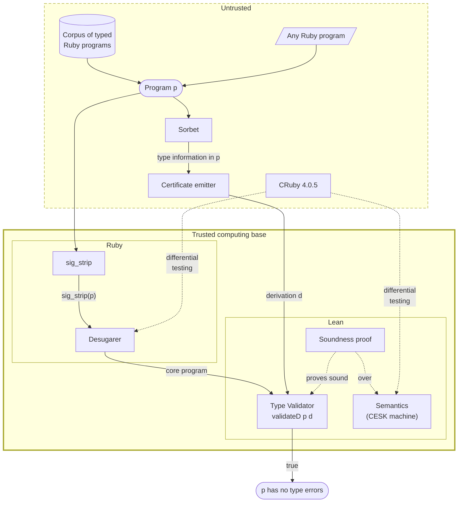

**Bottom line up front:** *I, with heavy augmentation from LLMs, have built an
executable Lean model of the Ruby semantics as a
[CESK machine](https://en.wikipedia.org/wiki/CEK_Machine#CESK_machine), together
with a proof of type soundness of a small fragment of type judgments inspired by
Sorbet over the semantics. The semantics is validated by differential testing
against Ruby, and passes a large swath of conformance tests. I believe this type
of modeling work will become increasingly important as we find ourselves losing
confidence in the world's agent-authored software. Through this project,
frontier LLMs have demonstrated great promise in shortening the timeline to
verifying software written in modern complex dynamic languages at scale.*

Check out the `ruby-lean` [playground](/ruby-lean) and see it in action. For the
technically inclined, see the
[Technical Appendix](2026-09-20-ruby-lean-technical-appendix.html). View the
source code on [GitHub](https://github.com/sam-xif/ruby-lean).

______________________________________________________________________

## Semantics done quick

This summer, I was a fellow in the
[Apart Research](https://apartresearch.com/research)
[Secure Program Synthesis](https://www.lesswrong.com/posts/8wtrLoDPyCfMLuHkt/how-to-solve-secure-program-synthesis)
fellowship, working with [Mike Dodds](https://mikedodds.org/) on his proposed
project,
[Semantics Done Quick](https://oath.tech/pub/2026/05/semantics-done-quick/).

The thesis of this project is simple: advanced AI should be able to greatly
accelerate the speed at which we can author and build on
[semantics](<https://en.wikipedia.org/wiki/Semantics_(programming_languages)>)
of programming languages and systems. Normally, these semantics are typically
formulated deep in research labs, with multi PhD-year long efforts culminating
in abstract theoretical results that make it to academic conferences but then
don't find usefulness in the real world, with the possible exception of
safety-critical work. Applications of these semantics include agent containment
and defense-in-depth of software at large.

As an outcome of this project, I am pleased to announce `ruby-lean`, my
semantics of Ruby in Lean. `ruby-lean` is an executable semantics, modeled as a
[CESK machine](https://en.wikipedia.org/wiki/CEK_Machine#CESK_machine), about
which a system of type judgments based on [Sorbet](https://sorbet.org/)—Ruby's
*de facto* type checking tool—has been proven sound. *Soundness* means: **if a
program passes the `ruby-lean` type validator, then it is completely free of a
certain family of type-related exceptions.**

I can probably count on my hands the number of lines of actual Lean code I wrote
by hand. Frontier AI breezed through a lot of the simpler parts of this project,
but when it came to the most difficult part of proving a hard property about a
complex model, I had to step in to unblock it by crystallizing the theorem
statements and the proof design approach. Admittedly, it was somewhat refreshing
to find a task that AI does not excel at immediately, and I came away with some
learnings about how to best steer AI on complex tasks like these.

## `ruby-lean` and its type validator

A live demo [playground](/ruby-lean) is available. It is seeded with many
example Ruby programs. Play around with it!


The above screenshot is from the playground. It showcases the five stages of how
this system determines the safety of a program:

1. Run Sorbet on a program with specific flags, so that Sorbet emits annotation
   information.
1. Strip the program's annotations, since Sorbet annotations are real syntax
   that's outside of the modeled fragment.
1. Desugar[]^(In the "syntactic sugar" sense. Most programming languages can be projected to simpler subsets of themselves. I don't go into much depth in this particular post for brevity, but this s-expression is roughly what the *desugaring* step does. The notion of "desugaring" was introduced by Krishnamurthi, Lerner, and Elberty in <a href="https://par.nsf.gov/servlets/purl/10124984"><i>The Next 700 Semantics: A Research Challenge</i></a>) the program, producing an s-expression that builds programs
   from a core set of Ruby primitives.
1. Run an *untrusted* certificate emitter (a companion program written in Ruby)
   that proposes type judgments for the program.
1. Run the *trusted* validator, given as `validateD p d` in `ruby-lean`'s code.
   This validates a type *derivation*--a proposed proof of
   well-typedness--against the program. The validator returns true if the
   derivation accurately types the program according to its internal rules, and
   we have proven a theorem that demonstrates the soundness of this validation
   procedure.

Here's how the pieces fit together, and where the trust boundary lies:



## Why this matters

If you're a programmer, you have a model of the behavior of your programming
language of choice living in your head. This is your model of the *semantics* of
the language. You probably find that you're able to use this model to predict
the behavior of programs in the language.

But we don't need to run programs in our heads, that's what compilers and
interpreters are for. A compiler/interpreter (ideally) faithfully implements a
language's semantics. The parenthetical deceptively relevant though; the fact
that compilers and interpreters need to be patched at all is evidence that
compilers and interpreters do not perfectly implement a language's semantics.

Beyond compiler/interpreter incorrectness, the bigger problem is that these
implementations of the semantics are not usable for mechanical reasoning.
Mechanical reasoning is cool because it enables computers to develop an
understanding of a system on their own, without a human poring over every line
of code.

In my several years in industry, I have always had a background voice in my head
wondering "will my code break when it hits production?" We engineers try to
placate our own worries about this by, well, poring over every line of code, and
by writing unit tests. Unit tests assert positive facts: "program X does this
desirable thing on this input", or "program X doesn't throw an exception on this
other input." Negative facts, like "no input causes program X to do Y," are
impossible to assert with unit tests. Fuzzers can help, but fuzzing effort needs
to be expended for every program one is interested in, and there is still no
guarantee that all of the interesting parts of the state space of the program
were explored, even under full code coverage.[]^("Program testing can be used to show the presence of bugs, but never to show their absence!" - Edsger Dijkstra)

Formal methods is where claims like these find a home. One negative fact that I
expect most programmers to be familiar with is the claim of type checking. The
claim is, implicitly, *if your program passes the type checker, then the typed
portions of the code do not throw a type error.* This is the claim that type
checkers like Sorbet and [mypy](https://mypy-lang.org/) make in Ruby and Python,
respectively. In order to *prove* this claim, we need an artifact that encodes
what Ruby programs and their types *mean*: the semantics. This artifact ideally
should live in a proof assistant tool so that we can reason about it
automatically.

I present a semantics of Ruby and prove such a negative property. This is
exciting because agent labor has significantly decreased the time and effort
required to construct semantics, making reasoning about programs at large
tantalizingly tractable. Reasoning about programs may become startlingly
necessary also, as too-loosely-monitored agents continue to poke around at
software. The safety properties that could defend against agent misbehavior are
precisely of this negative sort.

## "Why should I trust this?"

My semantics is validated against Ruby by differential testing. I have
implemented a multi-pronged conformance suite, where each prong generates test
cases via a different methodology. This is explained in more detail
[below](#phase-2-the-semantics).

If you have doubts, see for yourself: I have released a [playground](/ruby-lean)
where you can run Ruby code in original Ruby alongside the Lean semantics, via
compiled artifacts in WebAssembly. The
[code](https://github.com/sam-xif/ruby-lean) is open-source as well.

I am not pretending that the semantics is perfect. In fact, I recently
discovered an instance of non-conformance via a differential testing campaign. I
have not yet patched this, so while it is unpatched, you can convince yourself
that there are two distinct models of the language running by running the
following program:

```
class WithToStr
  def to_str = "ok"
end

puts "hi" + WithToStr.new 

# ruby-lean: TypeError: no implicit conversion of WithToStr into String
# CRuby: "hiok"
```

If you still aren't convinced and you think I hardcoded this example, tweak the
program a bit. The general behavioral difference is that original Ruby
automatically coerces the right-hand-side of a string's `+` via a to_str method.
My Lean semantics has not captured this behavior yet. When this is patched, I'll
leave behind an option to load up the version of the semantics that was active
at this time of writing.

In the type judgments and the soundness proof, I guarded against
[proof-slop](https://www.lesswrong.com/posts/rhAPh3YzhPoBNpgHg/lies-damned-lies-and-proofs-formal-methods-are-not-slopless)
by carefully auditing the end-to-end theorem statement. The end-to-end theorem,
given in the [Technical Appendix](2026-09-20-ruby-lean-technical-appendix.html),
is an easy-to-interpret statement that directly relates the validator to the
stuck-freedom property. The Lean kernel still has to be trusted, but this
coupled with the results I've been seeing in testing the validator on different
programs, gives me confidence that this property truly holds of the system. Of
course, there is a lot of room for extreme fuzzing to try to falsify this
property.

The Lean kernel has had soundness bugs, but I don't have reason to believe that
agents used any of them. I took great care to make sure that the tasks the AIs
were given were achievable. I did not give them impossible goal statements and
gave them emergency exits from goal pursuit that they could use if needed (a
suggestion borrowed from
[Mike Dodds](https://oath.tech/pub/2026/08/tentative-advice-building-with-ai/)).

## Why Ruby?

I chose Ruby for a few reasons:

1. **It isn't Python.** Python has been
   [treated](https://dl.acm.org/doi/abs/10.1145/2661088.2661101)
   [rather](https://arxiv.org/abs/1610.08476)
   [extensively](https://dl.acm.org/doi/abs/10.1145/2544173.2509536) in the
   literature (but ). It amusingly appears to be a popular topic
   [for](https://www.researchgate.net/publication/213877472_An_executable_operational_semantics_for_Python)
   [master's](https://arxiv.org/abs/2109.03139)
   [theses](https://www.ideals.illinois.edu/items/45257).[]^(I find this especially amusing because I, too, wished to do this for my master's thesis I conducted with Pete Manolios, but we eventually steered away from this idea on the premise that it would be too much of a lift without much practical value, so we settled on <a href="https://samx.io/papers/thesis.pdf">finding bugs in Python programs with fuzzing informed by their type annotations instead</a>.)
1. **It has high-profile users in industry.** Notably,
   [Stripe](https://stripe.com/) has one of the largest Ruby codebases in the
   world, where it powers their core payment rails. Homebrew is written in Ruby.
   Ruby on Rails is a mainstay in web development. Shopify is a prominent user
   of Ruby on Rails, and was funding
   [academic research for Ruby](https://shopify.engineering/shopify-ruby-at-scale-research-investment)
   as of several years ago.
1. **It's complicated.** Ruby has features that Python does not have that
   complicate static analysis. The example that immediately comes to mind is
   that of *blocks*. In Ruby, it's possible to pass a block to a function which
   is sort of like a lambda except it has different scoping rules and multiple
   ways that it can return. I believe there's a solid chance that Ruby is
   "semantics-complete." That is, if we can solve Ruby, we can solve semantics
   for every other language.[]^(I could be completely wrong here. I invite those who know much more than me in the field of programming languages to confirm or deny.)
1. **It has a *de facto* type checker.** Sorbet was created at Stripe, and it is
   used beyond Stripe as well. For instance, Homebrew makes extensive use of
   Sorbet types. Sorbet is unsound by construction, allowing `T.untyped(...)` as
   an escape hatch. However, we are particularly interested in what the maximal
   *sound fragment* of Sorbet is that we can model.

## Experience report

In building this system, I went through roughly five phases of construction:

1. Growing a desugaring function that takes high level Ruby and translates it
   into a smaller core language.
1. Growing the semantics out of lots of tokens and a differential testing.
   harness that compares to actual CRuby, version 4.0.5.
1. The first attempt at building a verified type checking decision procedure in
   Lean with an accompanying safety proof.
1. The second attempt, where instead of building a verified type checker, I
   built a type validator, that takes a program and an untrusted, emitted
   derivation of the types of the program.
1. The *third* attempt, where I gave the agents a strict ratchet discipline to
   follow. `ruby-lean` is the culmination of this approach, partway along in its
   ascent of the full corpus of "ladder" programs.[]^(The agents introduced some fun metaphors, like the corpus as a ladder of programs to climb, with a ratchet discipline referring to the monotonic nature of ascent up this ladder. And each "rung" climbed is a ratchet "clink.")

### Phase 1: desugaring

The first phase was straightforward, to the point where I deceptively thought
that the rest of this project would be a breeze. AI handily set up the Ruby
toolchain, scaffolded out a desugarer, and walked me through important design
decisions. In this phase, I established the `difftest` differential testing
harness, with its first mode, `--sut desugar`. As shown in the above diagram,
the desugarer is a part of the trusted computing base (TCB), so we need to
convince ourselves that it does not change program behavior. This is where I
worked with the agents to establish a baseline conformance suite derived from
the CRuby implementation's own suite of sanity checks:
[bootstraptest](https://github.com/ruby/ruby/tree/master/bootstraptest).

Here's an example Ruby program that exercises several of the key desugaring
rules, and its desugared counterpart:

::: details Original Ruby program

```ruby
def label(x)
  kind =
    case x
    when Integer then "int"
    when String  then "str"
    else "other"
    end
  "#{x.inspect} is a #{kind}"
end

cache = {}
[1, "a", 1].each do |v|
  cache[v] ||= label(v)
end
puts cache.values unless cache.empty?
```

:::

::: details Desugared output

```ruby
[:seq,
 [:def, "label", [[:preq, "x"]],
  [:seq,
   [:vasgn, :local, "kind",
    [:seq,
     [:vasgn, :local, "__dt_t1", [:var, :local, "x"]],
     [:if,
      [:send, [:const, "Integer"], "===", [[:var, :local, "__dt_t1"]], nil],
      [:str, "int"],
      [:if,
       [:send, [:const, "String"], "===", [[:var, :local, "__dt_t1"]], nil],
       [:str, "str"],
       [:str, "other"]]]]],
   [:send,
    [:send,
     [:seq,
      [:vasgn, :local, "__dt_t2", [:send, [:var, :local, "x"], "inspect", [], nil]],
      [:if,
       [:send, [:const, "String"], "===", [[:var, :local, "__dt_t2"]], nil],
       [:var, :local, "__dt_t2"],
       [:send, [:var, :local, "__dt_t2"], "__as_string", [], nil]]],
     "+",
     [[:str, " is a "]],
     nil],
    "+",
    [[:seq,
      [:vasgn, :local, "__dt_t3", [:var, :local, "kind"]],
      [:if,
       [:send, [:const, "String"], "===", [[:var, :local, "__dt_t3"]], nil],
       [:var, :local, "__dt_t3"],
       [:send, [:var, :local, "__dt_t3"], "__as_string", [], nil]]]],
    nil]]],
 [:vasgn, :local, "cache", [:hash, []]],
 [:send,
  [:array, [[:int, 1], [:str, "a"], [:int, 1]]],
  "each",
  [],
  [:block, [[:preq, "v"]], [], [],
   [:seq,
    [:vasgn, :local, "__dt_t4", [:var, :local, "cache"]],
    [:vasgn, :local, "__dt_t5", [:var, :local, "v"]],
    [:vasgn, :local, "__dt_t6",
     [:send, [:var, :local, "__dt_t4"], "[]", [[:var, :local, "__dt_t5"]], nil]],
    [:if, [:var, :local, "__dt_t6"], [:var, :local, "__dt_t6"],
     [:send, [:var, :local, "__dt_t4"], "[]=",
      [[:var, :local, "__dt_t5"], [:send, nil, "label", [[:var, :local, "v"]], nil]],
      nil]]]]],
 [:if,
  [:send, [:send, [:var, :local, "cache"], "empty?", [], nil], "!", [], nil],
  [:send, nil, "puts", [[:send, [:var, :local, "cache"], "values", [], nil]], nil],
  nil]]
```

:::

Notice that the `case` is replaced with an `:if`, and all method calls are
reduced to `:send` operations.

The desugarer passes 1,232 out of 1,309 of these bootstrap tests, with the
remainder not passing because some programs are out of the desugarer's supported
fragment.\
For instance, the desugarer does not handle `eval`, as exhibited by this
bootstraptest program:

```
puts "before"
eval "while true; return; end rescue p $!"
puts "after (never reached)"
```

Others are unparseable by the Ruby parser that we are using,
[Prism](https://github.com/ruby/prism).

### Phase 2: the semantics

Moving on to the semantics, agents again rather effortlessly scaffolded a Lean
project, set up the Ruby toolchain, and grinded the semantics up the ladder of
complexity of Ruby programs. I think this is because there are no difficult
proof goals in this phase; the work entirely lies in ensuring the definition is
correct and complete, with the differential testing harness there to guard
against any regressions. The `bootstraptest` corpus again provided a nice
ratchet discipline against which to grow the semantics.

As of the time of this writing, the semantics passes 995 / 1,309 `bootstraptest`
cases. The gap between the 995 and 1,309 total is explained partially by the
same 71-case gap in the desugarer's domain. The remainder are features that the
semantics do not yet model. I have no reason to believe these features can't be
modeled; the strong ratchet discipline developed for the semantics makes me
confident that this is tractable. Expanding the fragment just requires more time
and more tokens.

To validate the conformance of the semantics beyond the `bootstraptest` suite, I
also devised a multi-pronged differential testing harness. Each method of test
case generation is assigned a "tier." Tier 0 is the bootstrap test suite. Tier 1
is fuzzed programs by generating abstract syntax trees via
[Hypothesis](https://hypothesis.works/) strategies. Tier 1.5 is Tier 1, extended
with a transformer that inserts prints at various points in the program to
assert equivalence of effect ordering. Tier 3 is AI-generated strange cases of
Ruby programs. Tier 2 was intended to be selected Ruby snippets from Ruby
programs in the wild, but this has not yet been implemented. This multi-pronged
fuzzing suite has led to the discovery of several discrepancies over the growth
of the semantics, including one found very recently that has not yet been
patched, discussed in ["Why should I trust this?"](#why-should-i-trust-this).

### Phase 3-5: type system and soundness proof

This phase was where both I and the agents met difficulty. As noted above, I
went through three phases when trying to build a type system and prove soundness
(i.e. that a typed program cannot go wrong). For the sake of brevity, I'll
comment only on the third attempt that produced the results in this writeup and
briefly touch on learnings from previous modeling attempts as they arise.

First and foremost, the learnings from the first two attempts culminated in
clarification of the task definition. The current working definition of what the
type system and type validator are supposed to do is:

> Given a fully typed program $p$, and a derivation $d$, generated by
> an untrusted emitter $E(p, S(p))$, where $S(p)$ is the Sorbet type checker's
> emission of symbol and type information, grow a function `validate P D` such
> that when `validate sig_strip(p) d = true`, running `sig_strip(p)` will not
> result in a **type-stuck state**.

Type-stuckness is defined as a family of type-related exceptions that one might
expect type-checked programs to be free of (the full set is probably larger):

```lean
def typeErrorFamily : List ObjId :=
  [Boot.noMethodErrorId, Boot.argumentErrorId, Boot.typeErrorId]

def isTypeError (h : Heap) (exc : Value) : Bool :=
  typeErrorFamily.any (isA h exc)

def typeStuck : Interp.RunResult → Bool
  | .uncaught exc m => isTypeError m.heap exc
  | _ => false
```

The biggest boon to the agent grind was the adoption a strict ratchet discipline
in this setting as well. I could not, however, use the existing `bootstraptest`
ladder, because the input to the type validation pipeline is fully-typed
programs. The `bootstraptest` suite has none. So, I instead used agents to spin
up a 232-program
[corpus](https://github.com/sam-xif/ruby-lean/tree/main/ruby-lean/corpus) of
*typed* programs. This is the corpus given on the `ruby-lean`
[playground](/ruby-lean). More design notes can be found in the
[Technical Appendix](2026-09-20-ruby-lean-technical-appendix.html).

<!-- Two further design decisions also set this phase up for success. First, *I drew
inspiration from [RustBelt](https://plv.mpi-sws.org/rustbelt/popl18/paper.pdf)*.
I introduced a clear delination between the syntactic set of judgments, which
*define* type-correctness, and a semantic definition of what a judgment *means*,
by which the syntactic judgments must be proven correct with respect to the
semantics. This ensures the set of type judgments stay sound as they grow, and
it allows for *extensionality*. A new judgment rule can be proposed in the
semantic domain, and it is valid as long as it can be proven correct with
respect to the semantics. RustBelt used this pattern to prove safety of `unsafe`
Rust constructs.

Secondly, *I separated the concerns of soundness and completeness*, leaving
completeness to an untrusted emitter that proposes a derivation. The trusted validator's proof only asserts soundness. 
This means that the proof of the validator's soundness does not have
to account for the soundness/completeness of any type inference decision
procedure. This is exactly one of the flaws that led to me scrap the first
attempt at modeling a type system for Ruby and proving it sound. I had
agent-grinded a type checker that inferred types rather than just checking them,
and a successful check was a successful inference. This led to complex machinery
where the inductive safety invariant had to be specified in terms of this
inference algorithm, and the inference algorithm became a central part of the
soundness proof itself.[]^(One concrete way in which this led to negative consequences was that all of the metatheory in the initial attempt became dependent on implementation and compilation details of <code>infer</code>--the name of the function that defined the original inference algorithm. Proofs across the codebase made explicit
reference to details such as its case numbering and recursion scheme, greatly
compromising proof maintainability. I recall seeing several instances of a
pattern in the agent rollout where an agent would fold a new type judgment into
<code>infer</code>, and then would proceed to update proof tactics in 10-20 files to get
everything green again.) In general, deciding types for complex program
constructs like functions and loops is much more difficult than checking
postulated types. -->

With this in place, the agent grind of "throwing tokens at the problem" could
begin. The grind process was roughly as follows, in a loop:

1. For each new corpus program, propose a set of syntactic judgments that can be
   used to type the program.
1. Interpret the syntactic judgments as semantic judgments with respect to the
   Ruby abstract machine and a denotation of types as predicates over the
   abstract machine and program values.
1. Prove the semantic judgments correct. *Part of the definition of correctness
   is stuck-freedom*. Hence, well-typedness implies the safety property we're
   interested in.
1. Repair the end-to-end soundness theorem.

At each step, the agent was instructed that it cannot call a rung on the ladder
climbed until 1) the validator responds correctly for the new corpus element, 2)
each new type judgment has a corresponding discharged proof obligation and 3)
the proof for the end-to-end soundness theorem checks. More details about this
theorem and its helper theorems and lemmas are given in the
[Technical Appendix](2026-09-20-ruby-lean-technical-appendix.html).

<!-- 
#### Theorem: end-to-end soundness of the type validator

For all programs $p$ and certificates $d$, where `validate` is the
aforementioned type validator,

$$
\text{validate}\ p\ d = \text{true} \ \Longrightarrow\ \text{StuckFree}(\mathit{bootMachine},\ p)
$$

*Proof sketch:* Given in the
[Technical Appendix](2026-09-20-ruby-lean-technical-appendix.html). -->

## Cost of verification

Following
[Quinn's](https://www.lesswrong.com/posts/SG82BkTDQDAjANRWj/please-measure-verification-burden)
advice, I report the verification burden here.

The work to obtain this result unfolded over the course of ~2.5 months, at 10-20
hours per week of human labor, with $9,000 of token budget provided by Apart
Research.

The model used to author most of the code was Claude Opus 5. I occasionally used
Claude Fable 5 as a consultant, but I shied away from using it for grindy
sessions because I found that it burned through tokens far faster than I
intended, without much of a speedup of the ladder-climb. The final push towards
the soundness proof over a nontrivial fragment of Ruby that is presented here
was grinded with the new GPT 6 Astra model, which I found did a very good job at
a more reasonable cost profile, but this may also be due to the more rigorous
ratchet discipline I imposed in my most recent attempt at growth of a sound type
system.

## Limitations

In `ruby-lean` itself,

1. The semantics does not model the long tail of all esoteric Ruby features, and
   there are still lingering conformance issues where the semantics produces
   results that differ from actual CRuby. I do not see this as a major threat to
   validity of the small result I present here, since the proof checks in Lean
   and the semantics is faithful enough to run large programs, such as a
   thousand-line multi-file slice of Homebrew that I was using as a spot check.
1. The semantics does not model the behavior of Ruby programs that interact with
   the surrounding operating system, the internet, the file system, or other
   libraries. Ruby's `RubyGems` packaging system, however, is written in Ruby,
   which means that we may get this for free by running the Ruby code in our
   semantics once coverage of the Ruby language is expanded enough to cover all
   of the source code for `RubyGems` and other libraries.
1. The fragment of the type system is still small. It doesn't cover blocks, for
   instance, which I have already seen that agents struggle to type in my
   experimentation that led to this result. I will mount another attempt at this
   soon, since blocks are a pretty essential part of idiomatic Ruby.

I also think there are a lot of interesting open research questions in the
science of growing these semantics and steering agents to complete long-horizon
proof tasks. The grindy nature and "out-of-distribution"-ness of this project
lends itself nicely to benchmarking and RL hillclimbing on this type of task.

Specifically,

1. I have not developed a theory of how best to prompt LLMs to obtain useful
   semantics. This will require time and funding to run more controlled
   experiments and benchmarks. If you are interested in funding this, please let
   me know.
1. I did not run any comparison between different LLMs/harnesses for the tasks
   here, except for a brief stint playing around with GLM 5.2 and GLM 5.3,to no
   avail. I would be excited to work on benchmarking how agents perform at these
   long-horizon proof tasks under variable reasoning effort, harnesses, and
   prompting strategies. If you are interested in working on this or in funding
   it, let me know.
1. The definition of type-stuckness is somewhat arbitrary, and probably could've
   included more types of exceptions that are downstream of type-related issues
   in programs. Expanding the set of exceptions may superlinearly expand the
   verification burden. More experimentation is needed here to understand this.

## Future work

My immediate next steps are

1. Grind the semantics to cover any reasonable Ruby program
1. Grind the type system enough to run the type validator on a repo in the wild
   (Homebrew is my initial target)
1. Attempt to find real Sorbet unsoundness (i.e. not just unsoundness introduced
   by deliberate escape hatches).

Beyond these, something I would like to explore more is leveraging the semantics
for adversarial synthesis of
[deserialization attack chains](https://www.elttam.com/blog/ruby-4-0-universal-rce-deserialization-gadget-chain).
This is a recurring bug class in Ruby, and frankly in general; deserialization
of an uncontrolled input is a huge attack surface. I unlock deep mechanical
reasoning about this once I grind the semantics to near-complete coverage of
Ruby.

## Final thoughts

This post is less of an announcement of a finalized piece of work than a
check-in on one that is deeply in progress. Modern frontier models have shown
great aptitude for authoring proofs about programs and coming up with reasonable
lemma patterns that help them make progress, but not without significant human
input to provide a coherent problem setting with highly observable milestones,
as well as key insights that help the agent get unstuck at certain difficult
points.

Work is required, therefore, on the part of both the model labs, and on the part
of users to discover optimal techniques for leveraging these models as tools to
achieve our formalization goals.

Want to get involved? Reach out at
[s.xifaras999@gmail.com](mailto:s.xifaras999@gmail.com)!
