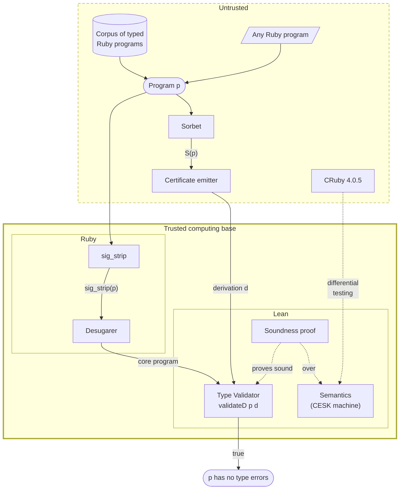

**Bottom line up front:** *I, with heavy augmentation from LLMs, have built an
executable Lean model of the Ruby semantics as a
[CESK machine](https://en.wikipedia.org/wiki/CEK_Machine#CESK_machine), together
with a proof of type soundness of a small fragment of type judgments inspired by
Sorbet over the semantics. The semantics is validated by differential testing
against Ruby, and passes a large swath of conformance tests. I believe this type
of modeling work will become increasingly important as we find ourselves losing
confidence in the world's agent-authored software. Through this project,
frontier LLMs have demonstrated great promise in shortening the timeline to
verifying software written in modern complex dynamic languages at scale.*

Check out the `ruby-lean` [playground](/ruby-lean) and see it in action. For the
technically inclined, see the
[Technical Appendix](2026-09-20-ruby-lean-technical-appendix.html). View the
source code on [GitHub](https://github.com/sam-xif/ruby-lean).

______________________________________________________________________

## Semantics done quick

This summer, I was a fellow in the
[Apart Research](https://apartresearch.com/research)
[Secure Program Synthesis](https://www.lesswrong.com/posts/8wtrLoDPyCfMLuHkt/how-to-solve-secure-program-synthesis)
fellowship, working with [Mike Dodds](https://mikedodds.org/) on his proposed
project,
[Semantics Done Quick](https://oath.tech/pub/2026/05/semantics-done-quick/).

The thesis of this project is simple: advanced AI should be able to greatly
accelerate the speed at which we can author and build on
[semantics](<https://en.wikipedia.org/wiki/Semantics_(programming_languages)>)
of programming languages and systems. Normally, these semantics are typically
formulated deep in research labs, with multi PhD-year long efforts culminating
in abstract theoretical results that make it to academic conferences but then
don't find usefulness in the real world, with the possible exception of
safety-critical work. Applications of these semantics include agent containment
and defense-in-depth of software at large.

As an outcome of this project, I am pleased to announce `ruby-lean`, my
semantics of Ruby in Lean. `ruby-lean` is an executable semantics, modeled as a
[CESK machine](https://en.wikipedia.org/wiki/CEK_Machine#CESK_machine), about
which a system of type judgments based on [Sorbet](https://sorbet.org/)—Ruby's
*de facto* type checking tool—has been proven sound. I can probably count on my
hands the number of lines of actual Lean code I wrote by hand. Frontier AI
breezed through a lot of the simpler parts of this project, but when it came to
the most difficult part of proving a hard property about a complex model, I had
to step in to unblock it by crystallizing the theorem statements and the proof
design approach. Admittedly, it was somewhat refreshing to find a task that AI
does not excel at immediately, and I came away with some learnings about how to
best steer AI on complex tasks like these.

## Why this matters

If you're a programmer, you have a model of the behavior of your programming
language of choice living in your head. This is your model of the *semantics* of
the language. You probably find that you're able to use this model to predict
the behavior of programs in the language.

But we don't need to run programs in our heads, that's what compilers and
interpreters are for. A compiler/interpreter (ideally) faithfully implements a
language's semantics. The parenthetical deceptively relevant though; the fact
that compilers and interpreters need to be patched at all is evidence that
compilers and interpreters do not perfectly implement a language's semantics.

<!-- Perhaps I need a paragraph to motivate why we care about type soundness-->

Beyond compiler/interpreter incorrectness, the bigger problem is that these
implementations of the semantics are not usable for mechanical reasoning.
Mechanical reasoning is cool because it enables computers to develop an
understanding of a system on their own, without a human poring over every line
of code.

<!-- Armed with just the interpreter as a tool, mechanically arguing the validity of
a statement about a Ruby program requires
[fuzzing](https://en.wikipedia.org/wiki/Fuzzing) the interpreter over the space
of possible inputs. With good enough fuzzing (i.e. the fuzzer's test case
generator eventually generates every possible input while quickly generating
"interesting" ones), the validity of the statement is approached asymptotically
and scales with compute. This works well in certain situations, and it seems
[bitter lesson](https://www.cs.utexas.edu/~eunsol/courses/data/bitter_lesson.pdf)-proof,
but not so fast. -->

In my several years in industry, I have always had a background voice in my head
wondering "will my code break when it hits production?" We engineers try to
placate our own worries about this by, well, poring over every line of code, and
by writing unit tests. Unit tests assert positive facts: "program X does this
desirable thing on this input", or "program X doesn't throw an exception on this
other input." Negative facts, like "no input causes program X to do Y," are
impossible to assert with unit tests. Fuzzers can help, but fuzzing effort needs
to be expended for every program one is interested in, and there is still no
guarantee that all of the interesting parts of the state space of the program
were explored, even under full code coverage.[]^("Program testing can be used to show the presence of bugs, but never to show their absence!" - Edsger Dijkstra)

<!-- 
What about a negative claim that ranges over *all programs?* This too can be
fuzzed, but even more ineffectively. The space of all programs is massive.
Fuzzing a claim like "If program P satisfies Q, then no run of P satisfies R"
means fuzzing to find programs that satisfy Q, then fuzzing each program that
satisfies Q to attempt to find a run that satisfies R. If the code under test is
pretty close to airtight but has subtle bugs, I would not trust this approach to
find them, even with lots of time and compute. And remember: not all programs
terminate! -->

Formal methods is where claims like these find a home. One negative fact that I
expect most programmers to be familiar with is the claim of type checking. The
claim is, implicitly, *if your program passes the type checker, then the typed
portions of the code do not throw a type error.* This is the claim that type
checkers like Sorbet and [mypy](https://mypy-lang.org/) make in Ruby and Python,
respectively. In order to *prove* this claim, we need an artifact that encodes
what Ruby programs and their types *mean*: the semantics. This artifact ideally
should live in a proof assistant tool so that we can reason about it
automatically.

I present a semantics of Ruby and prove such a negative property. This is
exciting because agent labor has significantly decreased the time and effort
required to construct semantics, making reasoning about programs at large
tantalizingly tractable. Reasoning about programs may become startlingly
necessary also, as too-loosely-monitored agents continue to poke around at
software. The safety properties that could defend against agent misbehavior are
precisely of this negative sort.

<!-- 
growing one in the Lean proof assistant with agent labor, and proving such a
negative property over it that immediately transfers to any Ruby program,
including ones that have not been written yet. "Prove once, apply anywhere" is
an underappreciated way in which formal methods can deliver compounding
benefits. -->

<!-- 
This matters because properties that assert the safety of software are also
negative properties, like the type checking one. Safety of software always
mattered, but it matters more now that highly persistent AI agents may soon be
doing the fuzzing our the world's software systems for us, and falsifying what
we believe are valid safety properties. -->

<!-- Formal methods matters a lot in this current moment, because it's the
only way to enforce containment that scales. -->

<!-- 


Proving the validator correct means we don't have to fuzz every concrete program
for type errors. We have a claim about *all* programs, even ones that don't
exist yet. Authoring a new program requires no extra work, beyond writing the
program, to trust the validator's claim about type safety. This is a powerful
illustration of how formal methods, though challenging to bootstrap, can deliver
compounding benefits.

In this post, I discuss an
[end-to-end soundness theorem](#theorem-end-to-end-soundness-of-the-type-validator):
*if a program validates against a proposed type derivation, then it can't go
wrong.* This matters because Ruby has a type system, implemented by
[Sorbet](https://sorbet.org/). Sorbet is trusted by large companies like Stripe
and Shopify every day to detect type errors in their code, but Sorbet is not
sound. It allows escape hatches like `T.untyped(...)`. But even if we put these
escape hatches aside, is Sorbet still sound? This is an open question, and
something that what I'm building here has the potential to answer. A soundness
bug in Sorbet immediately compromises the trust that Ruby developers across the
world place in a critical piece of their toolchain.

Formal proof uniquely suits solving this soundness problem because it is hard to
directly fuzz (program, derivation) pairs that satisfy a type validator. If the
validator is not satisfied the majority of the time, with the only
satisfiability witnesses[]^(A "witness" is FM-speak for an example.) being simple programs, then we have not
gained confidence in the validity of the theorem. All we might learn is that the
validator rejects nonsensical programs with nonsensical type derivations.

Even if a program *were* to pass the validator, fuzzing is again required to
mount the argument that it never goes wrong. Perhaps agent teams can be
instructed to find deep examples, but now this feels potentially more expensive
than using agent labor to formalize a semantics, a type system, and prove the
soundness theorem once and for all programs, which is what I did here.[]^(All programs that type according to the supported fragment of the type system. See the <a href="2026-09-20-ruby-lean-technical-appendix.html">Technical Appendix</a> for more details on what's supported at this time of writing.)

In sum, proving safety properties (bad thing X doesn't happen) has better
scaling properties with a formal semantics embedded in a proof assistant, while
being very interesting from a high-assurance engineering and cybersecurity
perspective perspective. -->

<!-- My argument: proving safety properties with agent labor in proof assistants has a better scaling law than proving safety properties outside of them-->

<!-- 

Perhaps the argument thread here is:
1. We have semantics in our heads.
2. The compiler/interpreter nominally implements them but even they have little bugs. And: because we don't have specifications of what our own programs do,
   we are relegated to lower levels on the verification ladder: unit testing and PBT. 

3. The compiler/interpreter are oracles; they don't provide a *computable* semantics.
4. to truly show the absence of bugs quantified over all inputs, a computable semantics is needed
5. A sort of informal proof by contradiction: suppose we want to show a type system is safe via fuzzing...we'd have to create a fuzzer that can actually generate well-typed programs, and we would need an oracle that validates that they actually are well-typed by fuzzing the programs.
This means that slippage can occur on two fronts: 1) we think the theorem is true because we don't see any failures, but 99+% of the test cases are vacuous cases (the program does not type check against its derivation) and 2) fuzzing each program to check stuck freedom could miss something, especially for deeply nested programs.

Proving such safety/negative properties (something doesn't happen) is both very interesting from a high-assurance engineering perspective and a cybersecurity perspective, and it is simply not tractable to do so without a formal semantics embedded in a proof assistant.

-->

<!-- Some general philosophical notes: 

we need to think in terms of asymptotes and probabilities here. 
Does formal methods even matter if we can obtain a 99.9% guarantee of safety? 

I think the problem of authoring a soundness theorem PBT and fuzzing it to quasiprove soundness
 and 
formally proving soundness with respect to some semantics, and quasiproving that the semantics 
faithfully models the implementation.


Are both sort of the same but their complexities lie in different places.


In the PBT formulation, generating a representative set of well-typed programs with random testing is the difficult part.
A PBT for this might look like:

def types_sound(p: Program, d: Deriv) -> bool:
  if not type_checks(p, d):  # we need to trust this type derivation checker too
    return true

  try:
   p.call  # run the program
  except e:
   if isTypeError(e): return false
  
  return true


-->

<!-- 
The compiler/interpreter also (ideally) implements the language's semantics. The
parenthetical is more relevant than you might think; the fact that interpreters
and compilers need to be patched is proof that interpreters and compilers do not
necessarily implement a language's semantics.

Dubiousness of the implementations of the world's programming language semantics
aside, we are not even able to symbolically execute industry-scale programs in
our heads. Even if we could, why would we want to? But not scrutinizing changes
to codebases as they get proposed and merged in is a recipe for poor software
quality and security. The fact that unit tests exist and are pervasive suggests
that all programmers need to perform some amount of automated reasoning about
code before it hits actual users. The commercial pressure incentivizes
it--software quality has become expected, and it is tied to revenue. -->

<!-- 
The problem is that a codebase's unit tests generally test a narrow and shallow
slice of the possible space of behaviors and program states. One 2019
[paper](https://ieeexplore.ieee.org/document/8816791) found that each additional
level of control flow nesting in Python programs reduced the probability that it
is tested by 19%. **Unit tests demand trust of the thoroughness and
representativeness of contributors' test cases.**

Property-based testing (PBT) offers a stronger guarantee of program correctness
by allowing a user to specify more abstract "properties" about their program.
For example, `f(x) = 2x` instead of `f(2) = 4`.
[Hypothesis](https://hypothesis.works/) is a PBT library for Python, and it
offers extensible example generation with *strategies.* **PBT demands trust of
the robustness fuzzing algorithm used to generate examples.** []^(For what it's worth, PBT also demands trust of the the thoroughness and representativeness of the human contributors' <i>properties</i>.)

Formal verification (FM) is the next level up. FM still lets a user specify
abstract properties about their program, but now the properties actually
quantify over all inputs. This addresses the systemic problem of fuzzing where
compute is finite, meaning that all we can hope for is what I like to call
"quasiproof." A fuzzing campaign may appear to converge while hiding a blind
spot that the fuzzer's test case generation logic does not cover. **FM demands
trust of the proof assistant's proof checker, and that the implementer proposes
actual interesting theorems to be proven,** -->

<!-- 
In PBT, agents can red team a property to try to really stress test it
In FM, agents can 
-->

<!-- 
In order to provide this guarantee, however, FM needs something in return: a
true specification of what the meaning of a given program is. This is like a
compiler/interpreter, except it is embedded in the proof assistant so that the
proof assistant can actually prove theorems about it. No proof assistant that I
know of supports reasoning about foreign code directly. If a proof assistant
does, that implies the use of some semantics of the language. Again, the
compiler/interpreter implements the semantics, but it is a "concrete"
implementation rather than a "symbolic" one. Executing `f(x)` without supplying
a value for `x` doesn't make sense in a concrete implementation. -->

<!-- You may ask, *why can't we embed the actual code of the Ruby interpreter into
the proof assistant, so that we don't need to have this trust boundary?* Great
question, and the answer is that the actual code of the Ruby interpreter itself
doesn't have a clear semantics! Ruby's implementation is written in C, and C has
*undefined behavior* which makes formal reasoning complicated. This doesn't even
account for the presence of bugs and memory leaks in the Ruby interpreter that
should not be part of a formal model. -->

<!-- 
The end-to-end soundness theorem is, *if a program validates against its
proposed type derivation, then it can't go wrong.* This problem lends itself to
formal proof because its hypothesis is difficult to satisfy. It is hard to fuzz
(program, derivation) pairs that satisfy the validator. And if the validator is
satisfied a tiny fraction of the time, and all of the satisfiability
witnesses[]^(A "witness" is FM-speak for an example.) are simple programs, then we have not gained much confidence
in the validity of the theorem. Even if a program were to pass the validator,
that program may also require fuzzing in order to mount the argument that it
never goes wrong. Perhaps agent red teams can be instructed to try to generate
and find deep examples, but this feels potentially more expensive than simply
using agent labor to formalize type soundness and prove that theorem for all
programs, which is what I did here. -->

<!-- Simply caching the PBT set once and using it
leaves it vulnerable to rot on a couple dimensions: 1) the test suite could
become out of date as the language features evolve, and 2) the agents can reward
hack if they realize that the test corpus is always the same. So agent tokens
will need to be spent to generate fresh corpora. Formal proof sidesteps all this
by requiring the agent to come up with the proofs, and then we can make the
claim that this approach is actually much cheaper than manual verification. -->

## "Why should I trust this?"

My semantics is validated against Ruby by differential testing. I have
implemented a multi-pronged conformance suite, where each prong generates test
cases via a different methodology. This is explained in more detail
[below](#phase-2-the-semantics).

If you have doubts, see for yourself: I have released a [playground](/ruby-lean)
where you can run Ruby code in original Ruby alongside the Lean semantics, via
compiled artifacts in WebAssembly. The
[code](https://github.com/sam-xif/ruby-lean) is open-source as well.

I am not pretending that the semantics is perfect. In fact, I recently
discovered an instance of non-conformance via a differential testing campaign. I
have not yet patched this, so while it is unpatched, you can convince yourself
that there are two distinct models of the language running by running the
following program:

```
class WithToStr
  def to_str = "ok"
end

puts "hi" + WithToStr.new 

# ruby-lean: TypeError: no implicit conversion of WithToStr into String
# CRuby: "hiok"
```

If you still aren't convinced and you think I hardcoded this example, tweak the
program a bit. The general behavioral difference is that original Ruby
automatically coerces the right-hand-side of a string's `+` via a to_str method.
My Lean semantics has not captured this behavior yet. When this is patched, I'll
leave behind an option to load up the version of the semantics that was active
at this time of writing.

In the type judgments and the soundness proof, I guarded against
[proof-slop](https://www.lesswrong.com/posts/rhAPh3YzhPoBNpgHg/lies-damned-lies-and-proofs-formal-methods-are-not-slopless)
by carefully auditing the
[end-to-end theorem](#theorem-end-to-end-soundness-of-the-type-validator)
statement. This is a relatively easy-to-understand statement that simply relates
the validator to a stuck-freedom property. The Lean kernel still has to be
trusted, but this coupled with the results I've been seeing in testing the
validator on different programs, gives me confidence that this property truly
holds of the system. Of course, there is a lot of room for extreme fuzzing to
try to falsify this property.

The Lean kernel has had soundness bugs, but I don't have reason to believe that
agents used any of them. I took great care to make sure that the tasks the AIs
were given were achievable. I did not give them impossible goal statements and
gave them emergency exits from goal pursuit that they could use if needed (a
suggestion borrowed from
[Mike Dodds](https://oath.tech/pub/2026/08/tentative-advice-building-with-ai/)).

<!-- 
## What are semantics?

More generally, "semantics" refers to the study of meaning in languages. In
human languages just as in programming languages, there is a correct structure
for forming sentences, known as *syntax*. The semantics of a language is what
takes syntactically valid sentences and grants them meaning. To get a deeper
sense of the difference, consider Noam Chomsky's famous example of an English
sentence that is syntactically valid but has no semantic meaning: "Colorless
green ideas sleep furiously." This sentence is grammatically correct (syntax)
but makes no sense. Ideas cannot be green, nor can they be colorless, and they
definitely can't be green and colorless at the same time--a logical
contradiction.

In a programming language like Ruby, the semantics of a sentence is its behavior
or effect on the surrounding system. For instance, the program

```
puts "Hello"
```

means "The string of characters 'Hello' is printed to the screen."

But...if you're familiar with computer systems, you may recognize that this is
not the full story. In English, just as in programming languages, meaning is
context-dependent, and there are different levels of meaning. For example, the
meaning of "I run across the yard" changes subtly depending on who is doing the
running (Are they slow or are they fast? Do they call a light jog "running?"),
and what a "yard" is and which one is being referenced in the context. As a
speaker of American English, I associate a "yard" with a grassy outdoor area
around a typical suburban home. British English associates that semantics more
closely with the term "garden".

Just as the meaning of "I run across the yard" depends on the variant of English
being spoken, the initial meaning I assigned to `puts "Hello"` depends on
certain facts about the context. For example, it assumes that the Ruby program
is run in something like a terminal and its output is not piped to another
process or to a file. If that were the case, "Hello" would not be printed to the
screen. Instead, those bytes would be sent to the destination of the pipe. So a
more accurate semantic *denotation* (linguistic term for "literal meaning") for
that program might be "The string of characters 'Hello' is sent to the standard
output stream."

If you're a programmer, you almost certainly have a model of the semantics of
your programming languages of choice living in your head. This model probably
corresponds in some way to the interpreter/compiler, enough so that, given some
set of programs, you would be able to predict their behavior without having to
run the code. This model is exactly the artifact I had agents generate in Lean. -->

## Why Ruby?

I chose Ruby for a few reasons:

1. **It isn't Python.** Python has been
   [treated](https://dl.acm.org/doi/abs/10.1145/2661088.2661101)
   [rather](https://arxiv.org/abs/1610.08476)
   [extensively](https://dl.acm.org/doi/abs/10.1145/2544173.2509536) in the
   literature. It amusingly appears to be a popular topic
   [for](https://www.researchgate.net/publication/213877472_An_executable_operational_semantics_for_Python)
   [master's](https://arxiv.org/abs/2109.03139)
   [theses](https://www.ideals.illinois.edu/items/45257).[]^(I find this especially amusing because I, too, wished to do this for my master's thesis I conducted with Pete Manolios, but we eventually steered away from this idea on the premise that it would be too much of a lift without much practical value, so we settled on <a href="https://samx.io/papers/thesis.pdf">finding bugs in Python programs with fuzzing informed by their type annotations instead</a>.)
1. **It has high-profile users in industry.** Notably, Stripe has one of the
   largest Ruby codebases in the world, where it powers their core payment
   rails. Homebrew is written in Ruby. Ruby on Rails is a mainstay in web
   development. Shopify is a prominent user of Ruby on Rails, and was funding
   [academic research for Ruby](https://shopify.engineering/shopify-ruby-at-scale-research-investment)
   as of several years ago.
1. **It's complicated.** Ruby has features that Python does not have that
   complicate static analysis. The example that immediately comes to mind is
   that of *blocks*. In Ruby, it's possible to pass a block to a function which
   is sort of like a lambda except it has different scoping rules and multiple
   ways that it can return. I believe there's a solid chance that Ruby is
   "semantics-complete." That is, if we can solve Ruby, we can solve semantics
   for every other language.[]^(I could be completely wrong here. I invite those who know much more than me in the field of programming languages to confirm or deny.)
1. **It has a *de facto* type checker.** Sorbet was created at Stripe, and it is
   used beyond Stripe as well. For instance, Homebrew makes extensive use of
   Sorbet types. Sorbet is unsound by construction, allowing `T.untyped(...)` as
   an escape hatch. However, we are particularly interested in what the maximal
   *sound fragment* of Sorbet is that we can model.

## The system

A live demo [playground](/ruby-lean) is available. I encourage you to go play
with it :).


The above screenshot is from the playground. It showcases the five stages of how
this system determines the safety of a program:

1. Run Sorbet on a program with specific flags, so that Sorbet emits annotation
   information.
1. Strip the program's annotations, since Sorbet annotations are real syntax
   that's outside of the modeled fragment.
1. Desugar[]^(In the "syntactic sugar" sense. Most programming languages can be projected to simpler subsets of themselves. I don't go into much depth in this particular post for brevity, but this s-expression is roughly what the *desugaring* step does. The notion of "desugaring" was introduced by Krishnamurthi, Lerner, and Elberty in <a href="https://par.nsf.gov/servlets/purl/10124984"><i>The Next 700 Semantics: A Research Challenge</i></a>) the program, producing an s-expression that builds programs
   from a core set of Ruby primitives.
1. Run an *untrusted* certificate emitter (a companion program written in Ruby)
   that proposes type judgments for the program.
1. Run the *trusted* validator, given as `validateD p d` in `ruby-lean`'s code.
   This validates a type *derivation*--a proposed proof of
   well-typedness--against the program. The validator returns true if the
   derivation accurately types the program according to its internal rules, and
   we have a [theorem](#theorem-end-to-end-soundness-of-the-type-validator) that
   demonstrates the soundness of this validation procedure.

Here's how the pieces fit together, and where the trust boundary lies:



## Experience report

In building this system, I went through roughly five phases of construction:

1. Growing a desugaring function that takes high level Ruby and translates it
   into a smaller core language.
1. Growing the semantics out of lots of tokens and a differential testing.
   harness that compares to actual CRuby, version 4.0.5.
1. The first attempt at building a verified type checking decision procedure in
   Lean with an accompanying safety proof.
1. The second attempt, where instead of building a verified type checker, I
   built a type validator, that takes a program and an untrusted, emitted
   derivation of the types of the program.
1. The *third* attempt, where I gave the agents a strict ratchet discipline to
   follow. `ruby-lean` is the culmination of this approach, partway along in its
   ascent of the full corpus of "ladder" programs.[]^(The agents introduced some fun metaphors, like the corpus as a ladder of programs to climb, with a ratchet discipline referring to the monotonic nature of ascent up this ladder. And each "rung" climbed is a ratchet "clink.")

### Phase 1: desugaring

The first phase was simple, to the point where I deceptively thought that the
rest of this project would be a breeze. AI handily set up the Ruby toolchain,
scaffolded out a desugarer, and walked me through important design decisions. In
this phase, I established the `difftest` differential testing harness, with its
first mode, `--sut desugar`. The desugarer is an part of the trusted computing
base (TCB), so we need to convince ourselves that it does not change program
behavior. This is where I worked with the agents to establish a baseline
conformance suite derived from the CRuby implementation's own suite of sanity
checks: [bootstraptest](https://github.com/ruby/ruby/tree/master/bootstraptest).

Here's an example original Ruby program that exercises several of the key
desugaring rules, and its desugared counterpart:

::: details Original Ruby program

```ruby
def label(x)
  kind =
    case x
    when Integer then "int"
    when String  then "str"
    else "other"
    end
  "#{x.inspect} is a #{kind}"
end

cache = {}
[1, "a", 1].each do |v|
  cache[v] ||= label(v)
end
puts cache.values unless cache.empty?
```

:::

::: details Desugared output

```ruby
[:seq,
 [:def, "label", [[:preq, "x"]],
  [:seq,
   [:vasgn, :local, "kind",
    [:seq,
     [:vasgn, :local, "__dt_t1", [:var, :local, "x"]],
     [:if,
      [:send, [:const, "Integer"], "===", [[:var, :local, "__dt_t1"]], nil],
      [:str, "int"],
      [:if,
       [:send, [:const, "String"], "===", [[:var, :local, "__dt_t1"]], nil],
       [:str, "str"],
       [:str, "other"]]]]],
   [:send,
    [:send,
     [:seq,
      [:vasgn, :local, "__dt_t2", [:send, [:var, :local, "x"], "inspect", [], nil]],
      [:if,
       [:send, [:const, "String"], "===", [[:var, :local, "__dt_t2"]], nil],
       [:var, :local, "__dt_t2"],
       [:send, [:var, :local, "__dt_t2"], "__as_string", [], nil]]],
     "+",
     [[:str, " is a "]],
     nil],
    "+",
    [[:seq,
      [:vasgn, :local, "__dt_t3", [:var, :local, "kind"]],
      [:if,
       [:send, [:const, "String"], "===", [[:var, :local, "__dt_t3"]], nil],
       [:var, :local, "__dt_t3"],
       [:send, [:var, :local, "__dt_t3"], "__as_string", [], nil]]]],
    nil]]],
 [:vasgn, :local, "cache", [:hash, []]],
 [:send,
  [:array, [[:int, 1], [:str, "a"], [:int, 1]]],
  "each",
  [],
  [:block, [[:preq, "v"]], [], [],
   [:seq,
    [:vasgn, :local, "__dt_t4", [:var, :local, "cache"]],
    [:vasgn, :local, "__dt_t5", [:var, :local, "v"]],
    [:vasgn, :local, "__dt_t6",
     [:send, [:var, :local, "__dt_t4"], "[]", [[:var, :local, "__dt_t5"]], nil]],
    [:if, [:var, :local, "__dt_t6"], [:var, :local, "__dt_t6"],
     [:send, [:var, :local, "__dt_t4"], "[]=",
      [[:var, :local, "__dt_t5"], [:send, nil, "label", [[:var, :local, "v"]], nil]],
      nil]]]]],
 [:if,
  [:send, [:send, [:var, :local, "cache"], "empty?", [], nil], "!", [], nil],
  [:send, nil, "puts", [[:send, [:var, :local, "cache"], "values", [], nil]], nil],
  nil]]
```

:::

Notice that the `case` is replaced with an `:if`, and all method calls are
reduced to `:send` operations.

The desugarer passes 1,232 out of 1,309 of these bootstrap tests, with the
remainder not passing because some programs are out of the desugarer's
recognized syntax fragment, and others are unparseable by the Ruby parser that
we are using, [Prism](https://github.com/ruby/prism).

The desugarer, does not `eval`, for instance, as exhibited by this bootstraptest
program:

```
puts "before"
eval "while true; return; end rescue p $!"
puts "after (never reached)"
```

### Phase 2: the semantics

This phase was relatively straightforward. It felt rather effortless to use
agents to scaffold out a Lean project, set up the Ruby toolchain, and grind the
semantics up the ladder of complexity of Ruby programs. I think this is because
there are no difficult proof goals; the work entirely in making sure the
definition is correct, with the differential testing harness there to guard
against any regressions. The `bootstraptest` corpus here again provided a nice
ratchet discipline against which to grow the semantics.

As of the time of this writing, the semantics passes 995 / 1,309 `bootstraptest`
cases. The gap between the 995 and 1,309 total is explained partially by the
same 71-case gap in the desugarer's domain. The remainder simply are features
that the semantics do not yet model. We have no reason to believe we can't model
these features; expanding the fragment simply requires more time and more
tokens. The strong ratchet discipline developed for the semantics makes me
confident in the tractability of modeling these long-tail features.

To validate the conformance of the semantics beyond the `bootstraptest` suite, I
also devised a multi-pronged differential testing harness. Each method of test
case generation is assigned a "tier." Tier 0 is the bootstrap test suite. Tier 1
is fuzzed programs by generating abstract syntax trees via
[Hypothesis](https://hypothesis.works/) strategies. Tier 1.5 is Tier 1, extended
with a transformer that inserts prints at various points in the program to
assert equivalence of effect ordering. Tier 3 is AI-generated strange cases of
Ruby programs. Tier 2 was intended to be selected Ruby snippets from Ruby
programs in the wild, but this has not yet been implemented. This multi-pronged
fuzzing suite has led to the discovery of several discrepancies over the growth
of the semantics, including one found very recently that has not yet been
patched:

```ruby
class WithToStr
  def to_str = "ok"
end

puts "hi" + WithToStr.new 

# ruby-lean: TypeError: no implicit conversion of WithToStr into String
# CRuby: "hiok"
```

### Phase 3-5: type system and soundness proof

This phase was where both I and the agents met difficulty. As noted above, I
went through three phases when trying to build a type system and prove soundness
(i.e. that a typed program cannot go wrong). For the sake of brevity, I'll go
into depth on my third and final attempt that produced the results in this
writeup, commenting on learnings from previous modeling attempts as they arise.

First and foremost, the learnings from the first two attempts culminated in
clarification of the task definition. The current working definition of what the
type system and type validator are supposed to do is:

> Given a fully typed program $p$, and a derivation $d$, generated by
> an untrusted emitter $E(p, S(p))$, where $S(p)$ is the Sorbet type checker's
> emission of symbol and type information, grow a function `validate P D` such
> that when `validate sig_strip(p) d = true`, running `sig_strip(p)` will not
> result in a **type-stuck state**.

Type-stuckness is defined as a family of type-related exceptions that, given
information about the types, I thought would be reasonably straightforward to
prove the absence of:

```lean
def typeErrorFamily : List ObjId :=
  [Boot.noMethodErrorId, Boot.argumentErrorId, Boot.typeErrorId]

def isTypeError (h : Heap) (exc : Value) : Bool :=
  typeErrorFamily.any (isA h exc)

def typeStuck : Interp.RunResult → Bool
  | .uncaught exc m => isTypeError m.heap exc
  | _ => false
```

The biggest boon to the agent grind was the adoption a strict ratchet discipline
in this setting as well. I could not, however, use the existing `bootstraptest`
ladder, because the input to the type validation pipeline is fully-typed
programs, of which the `bootstraptest` suite has none. So, I instead used agents
to spin up a 232-program
[corpus](https://github.com/sam-xif/ruby-lean/tree/main/ruby-lean/corpus) of
*typed* programs. This is the corpus given on the `ruby-lean`
[playground](/ruby-lean).

Two further design decisions also set this phase up for success. First, *I drew
inspiration from [RustBelt](https://plv.mpi-sws.org/rustbelt/popl18/paper.pdf)*.
I introduce a clear delination between the syntactic set of judgments, which
*define* type-correctness via an inductive relation, and a semantic definition
of what a judgment is, by which the syntactic judgments must be proven correct
with respect to the semantics. This helped the set of type judgments stay sound
as they grow, and it allows for *extensionality*. A new judgment rule can be
proposed in the semantic domain, and it is valid as long as it can be proven
correct with respect to the semantics. If desired, this new semantic judgment
can be lifted to the syntactic domain by extending the syntactic definition of
types and used in the surface type checker. Rustbelt used this pattern to prove
safety of `unsafe` Rust constructs.

Secondly, *I separated the concerns of soundness and completeness*, leaving
completeness to an untrusted emitter that proposes a derivation, and
constraining the subject of the trusted validator and proof to be about
soundness. This means that the proof of the validator's soundness does not have
to account for the soundness/completeness of any type inference decision
procedure. This is exactly one of the flaws that led to me scrapping the first
attempt at modeling a type system for Ruby and proving it sound. I had
agent-grinded a type checker that inferred types rather than just checking them,
and a successful check was a successful inference. This led to complex machinery
where the inductive safety invariant had to be specified in terms of this
inference algorithm, and the inference algorithm became a central part of the
soundness proof itself.[]^(One concrete way in which this led to negative consequences was that all of the metatheory in the initial attempt became dependent on implementation and compilation details of <code>infer</code>--the name of the function that defined the original inference algorithm. Proofs across the codebase made explicit
reference to details such as its case numbering and recursion scheme, greatly
compromising proof maintainability. I recall seeing several instances of a
pattern in the agent rollout where an agent would fold a new type judgment into
<code>infer</code>, and then would proceed to update proof tactics in 10-20 files to get
everything green again.) In general, deciding types for complex program
constructs like functions and loops is much more difficult than checking
postulated types.

With all this in place, the agent grind of "throwing tokens at the problem"
could begin. The grind process was roughly as follows, in a loop:

1. For each new corpus program, propose a set of syntactic judgments that can be
   used to type the program.
1. Interpret the syntactic judgments as semantic judgments with respect to the
   Ruby abstract machine and a denotation of types as predicates over the
   abstract machine and program values.
1. Prove the semantic judgments correct. *Part of the definition of correctness
   is stuck-freedom*. Hence, well-typedness implies the safety property we're
   interested in.
1. Repair the end-to-end soundness theorem.

At each step, the agent was instructed that it cannot call a rung on the ladder
climbed until 1) the validator responds correctly for the new corpus element, 2)
each new type judgment has a corresponding discharged proof obligation and 3)
the proof for the end-to-end soundness theorem checks. More details about this
theorem and its helper theorems and lemmas are given in the
[Technical Appendix](2026-09-20-ruby-lean-technical-appendix.html). Since this
is the central result, however, I also include the end-to-end soundness theorem
below.

#### Theorem: end-to-end soundness of the type validator

For all programs $p$ and certificates $d$ (where `validateD` is the
aforementioned `validate` function in the actual Lean code),

$$
\text{validateD}\ p\ d = \text{true} \ \wedge\ \text{bootOkB} = \text{true} \ \Longrightarrow\ \text{StuckFree}(\mathit{bootMachine},\ p)
$$

*Proof sketch.* $\text{validateD}\ p\ d = \text{true}$ yields a `DJudge` derivation by projection (Lemma
`validateD_typed`); the adequacy theorem between the syntactic and semantic
judgments produces an equivalent semantic judgment; each semantic judgment's
conclusion carries the stuck-freedom (safety) property, proven via another
soundness helper theorem over the entire semantic judgment registry, so the
$\text{StuckFree}$ conclusion falls out naturally. `bootOkB` is a `#guard`ed Boolean that
asserts well-formedness of the inital state of $\mathit{bootMachine}$, which is the state of
the machine after a large Ruby program that seeds many core definitions, called
the *prelude*, has run.

## Cost of verification

Following
[Quinn's](https://www.lesswrong.com/posts/SG82BkTDQDAjANRWj/please-measure-verification-burden)
advice, I report the verification burden here.

The work to obtain this result unfolded over the course of ~2.5 months, at 10-20
hours per week of human labor, with $9,000 of token budget provided by Apart
Research.

The model used to author most of the code was Claude Opus 5. Claude Fable 5 was
occasionally used as a consultant, but I shied away from using it for grindy
sessions because I found that it burned through tokens far faster than I
would've liked, without that much of an uplift in the speed towards closure of
goals. The final push towards the soundness proof over a nontrivial fragment of
Ruby that is presented here was grinded with the new GPT 6 Astra model, which I
found did a very good job at a more reasonable cost profile, but this may also
be due to the more structured ratchet discipline I have created in the most
recent attempt at growth of a sound type system.

## Limitations

This work has several limitations. One obvious limitation is the fact that the
grind isn't complete; this can be solved with more token budget. There are other
limitations that relate more to the design approach, however, and require
exploration/treatment in future work.

Here is a sampling of limitations, roughly in order from most severe to least
severe.

1. The semantics, while largely conformant for typical on-rails Ruby, does not
   fully model the long tail of all esoteric Ruby features, and there are still
   lingering conformance issues where the semantics produces results that differ
   from actual CRuby. I do not see this as a major threat to validity of the
   small result presented here, since the proof checks in Lean and the semantics
   is faithful enough to run large programs, such as a thousand-line multi-file
   slice of Homebrew that I was using as a benchmark.
1. Beyond features of Ruby itself, the semantics also has a blind spot when it
   comes to modeling the behavior of Ruby programs that interact with the
   surrounding operating system, the internet, the file system, or other
   libraries. Ruby's `RubyGems` packaging system, however, is written in Ruby,
   which means that we may not need to explicitly model all of Ruby's dependency
   management. We may simply get this for free by running the Ruby code in our
   semantics once coverage of the Ruby language is expanded enough to cover all
   of the source code for `RubyGems` and other libraries.
1. The fragment of the type system is still small. It doesn't cover blocks, for
   instance, which I have already seen that agents struggle to type in my
   experimentation that led to this result.
1. I have not developed a theory of how best to prompt LLMs to obtain useful
   semantics. This will require time and funding to run more controlled
   experiments and benchmarks. If you are interested in funding this, please let
   me know.
1. I did not run any comparison between different LLMs for the tasks here,
   except for a brief stint playing around with GLM 5.2 and GLM 5.3,to no avail.
   Benchmarking how agents perform at these long-horizon proof tasks under
   variable reasoning effort, harnesses, and prompting strategies would be very
   exciting to work on in my view. If you are interested in working on this, or
   interested in funding it, let me know.
1. The definition of type-stuckness is somewhat arbitrary, and probably could've
   included more types of exceptions that are downstream of type-related issues
   in programs. Expanding the set of exceptions may superlinearly expand the
   verification burden. More experimentation is needed here to understand this.

## Future work

A lot of future work lays before us. Here I catalog some of the directions I
find most exciting.

*Continue the grind.* To make this Ruby semantics viable for commercial use, the
supported fragment of the Ruby semantics needs to be grown. A rough target to
shoot for, not just in this project, but in all such projects of formalizing an
industrial programming language, is to cover the 99.9th percentile of programs.
Put another way, suppose I have a sampler for Ruby programs that the average
Ruby developer would write. Assume that the existing set of Ruby programs
already in the wild is drawn from this distribution also. If a Ruby program has
99 transitive dependencies (suppose each transitive dependency is a program the
sampler could produce), this implies a $99.9\% ^{100} \approx 90.5\%$ chance that the transitive
closure of the program is runnable in the semantics. These are pretty good odds.
Two 9s of support wouldn't be enough: a 100-program complex would have a
$99\%^{100} \approx 36.6\%$ chance of being fully supported in that case.

*Generalize to all industry use-cases.* If pushing support beyond 99% proves to
be extremely challenging, then we can explore intermixing code that's modeled by
the semantics and code that is not, with a linkage established through some
oracle semantics (demonic or
[angelic](https://link.springer.com/chapter/10.1007/978-3-319-21690-4_19)), or
an LLM-proposed formal interface that is validated against the unmodeled library
via differential testing.

*Identify real Sorbet gaps.* I will consider this formal model truly
battle-tested when we can identify real gaps in the current Ruby state of the
art in static program verification, Sorbet (with
[Steep](https://github.com/soutaro/steep) as what appears to be an emerging
challenger). Some ways we could find gaps include:

- Leveraging the extensionality of our system of type judgments with our type
  system extended with a complex new judgment, we accept a program Sorbet
  doesn't. We become more *complete* than Sorbet.
- Sorbet accepts a fully-typed program that we reject, and we can find a
  counterexample that shows the program is not type safe. We show Sorbet is
  dangerously *unsound*. This unsoundness is dangerous because even code in the
  strictly typed fragment can't be trusted.
- We show via proof/disproof that some of Sorbet's type inference rules are
  unsound. This would require a differential testing harness that deeply probes
  Sorbet's behavior, coupled with agentic analysis of Sorbet's documentation, to
  produce a trustworthy collection of Sorbet's actual type judgments. The
  architecture I have supports this, but I have not made it an explicit part of
  the most recent agent grind loop.

*Prove safety properties beyond types.* I have explored this area least so far
in this workstream. As a first use-case to target in this specific project, I am
particularly excited about formalizing a safety property that specifies the
absence of Ruby
[deserialization RCE exploits](https://www.elttam.com/blog/ruby-4-0-universal-rce-deserialization-gadget-chain),
since bugs in this class have recurred repeatedly for many years. The latest
attack exploits behaviors that would be impractical to patch because doing so
would require fundamental changes to the Ruby langauge.

## Final thoughts

This post is less of an announcement of a finalized piece of work than a
check-in on one that is deeply in progress. Modern frontier models have shown
great aptitude for authoring proofs about programs and coming up with reasonable
lemma patterns that help them make progress, but not without significant human
input to provide a coherent problem setting with highly observable milestones,
as well as key insights that help the agent get unstuck at certain difficult
points.

Work is required, therefore, on the part of both the model labs, and on the part
of users to discover optimal techniques for leveraging these models as tools to
achieve our formalization goals.

Want to get involved? Reach out at
[s.xifaras999@gmail.com](mailto:s.xifaras999@gmail.com)!
