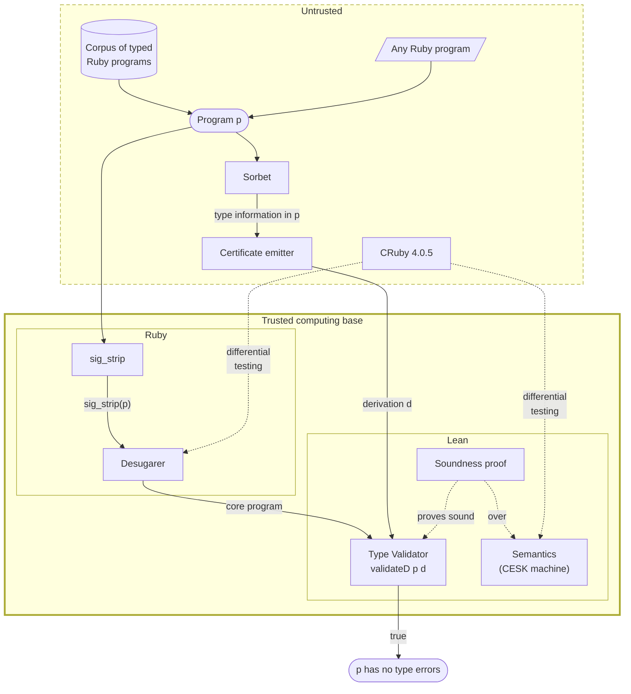

**Bottom line up front:** *I, with heavy augmentation from LLMs, have built an
executable model of Ruby's semantics in Lean, together with a proof of type
soundness for a small fragment of Sorbet's type system built on the semantics.
The semantics is validated by differential testing against Ruby and passes a
large swath of conformance tests. Through this project, I learned firstly that
agents do great at long-horizon tasks if the task definition is clear; if it is
not clear, they mess up in unpredictable ways. Secondly, I learned that advanced
AI, via its ability to work with proof assistants, has the potential to
revolutionize how we manage the correctness of software.*

Check out the `ruby-lean` [playground](/ruby-lean) and see it in action. For the
technically inclined, see the
[Technical Appendix](2026-09-26-ruby-lean-technical-appendix.html). View the
source code on [GitHub](https://github.com/sam-xif/ruby-lean).

[TOC]

______________________________________________________________________

## Introduction: "Semantics Done Quick"

Suppose you have a program in your language of choice, and you want to prove
that it is correct. Proof here means *for all inputs*, of which there could be
infinitely many. No amount of unit tests can satisfy that obligation.[]^("Program testing can be used to show the presence of bugs, but never to show their absence!" —Edsger Dijkstra)
So, you need a mathematical argument. This is where
[formal methods](https://en.wikipedia.org/wiki/Formal_methods) shines.

How might you mount a mathematical argument for the correctness of a program,
though? First, you need to define correctness. A simple definition is "this
program terminates and returns a value." Now, you need to define *meaning*. To
see why, take the program `"2" + 2`. The meaning of this is ambiguous because it
depends on the programming language. If you've ever written JavaScript, you may
recognize that this program evaluates to `"22"`. In
[Ruby](https://www.ruby-lang.org/en/), this program throws an exception. These
outcomes hint at the *computational intent* of the statement in each language.
In JavaScript, the meaning is approximately "concatenate the string '2' with the
result of coercing 2 into a string." In Ruby, the meaning is "attempt to call
the string's `+` operator with 2 as an operand, which attempts to coerce 2 using
the `to_str` method." This fails as the code for `String#+` executes, because
the `Integer` class has no `to_str` method. This definition of meaning, given by
computational intent, is known as a programming language's
[*semantics*](<https://en.wikipedia.org/wiki/Semantics_(programming_languages)>).[]^(A fun lightning talk by Gary Bernhardt on the weirdness of the semantics of these two languages can be found <a href="https://www.destroyallsoftware.com/talks/wat">here</a>.)
When the semantics is loaded into a proof assistant like
[Lean](https://lean-lang.org/), we can mechanically reason about programs and
their correctness!

Armed with a definition of correctness and a semantics, consider a program like
`"2" + x`, where `x` is some input variable. In JavaScript, this program is
correct for any `x` except specific cases like `x = Symbol()`. In Ruby, this
program is correct for any `x` that can be coerced into a string (i.e., `x` has
a `to_str` method). To make the Ruby program correct for all inputs, we can make
the `to_str` check explicit:

```ruby
"2" + x if x.respond_to?(:to_str)
```

The astute reader might notice that even this is not correct! Evaluating
`x.to_str` could still raise an exception or not terminate.

<!-- Such a proof is hard to author and check by hand, so ideally,
the semantics is an artifact that is defined in a proof assistant like
[Lean](https://lean-lang.org/). With a semantics in a proof assistant, we can
reason about programs mechanically! -->

These example programs are dead simple, and yet they still have many edge cases
that are hard to reason about. This is why modeling the semantics of entire
programming languages has historically taken multiple PhD-years of effort.
[Mike Dodds](https://mikedodds.org/) proposed
[Semantics Done Quick](https://oath.tech/pub/2026/05/semantics-done-quick/) out
of the belief that advanced AI should be able to greatly accelerate the
construction of useful semantics. I say "useful" because results about semantics
make it to academic conferences but don't find broad use in industry.

Why? It's not that semantics are inherently useless. Quite the opposite: they
are *generally* useful because we can vary our definition of correctness to suit
the task at hand. They can be used, for instance, to prove *soundness of type
checking*, which states that if a type checker—like
[Sorbet](https://sorbet.org/), which is widely used for Ruby—accepts a program,
then the typed parts of the program are truly free of type errors. This has
immediate business value: it provably rules out certain uncaught exceptions in
production code. Semantics can additionally be used to prove robustness against
malicious inputs so that software can be relied on in security-critical
contexts.

Rather, semantics are not adopted because:

1. they often have severe limitations, such as not being able to model the
   complex parts of a given language, which tend to be the most useful; and
1. authoring proofs against them requires technical expertise in formal methods
   and in the specific nature of the semantics.

Advanced AI shows promise in addressing both of these impediments.

<!-- Termination is
[undecidable](https://en.wikipedia.org/wiki/Halting_problem) in general, but
reasoning about *type safety* can help with the possibility of exceptions. -->

<!-- 
Type checkers, like [Sorbet](https://sorbet.org/) for Ruby, claims *if your
program passes, then the typed portions of the code never throw a type error.* A
type checker is *sound* if a successful type check implies that the program
truly is free of type errors. Unsoundness means the type checker can't be
trusted; it could accept a program that has type errors. This has real-world
implications; type checkers have seen great adoption in industry because
uncaught exceptions have real negative business impact. Soundness is therefore a
type checker's definition of correctness, and the semantics are useful because
they let us prove it. -->

<!-- 
It's much in the same way you might mount an argument that $"2 + 2 = 4"$ is a true
statement. This statement seems obviously true, but let's say I have some mental
block where I interpret all 4's as 5's. Now, "$2 + 2 = 4$" is nonsense to me,
because my *semantic* interpretation of this is $2 + 2 = 5$ (note the lack of
quotes). If you can convince me to fix my mental block so that $"4" \rightarrow 4$ again,
then I can be convinced that $"2 + 2 = 4" \rightarrow 2 + 2 = 4$, and then you can argue by basic
arithmetic that $"2 + 2 = 4"$ is correct. -->

<!-- 
To do this for programs in a programming language, we need to define what this
$\rightarrow$ operator does for sentences in the language. This *is* its
[semantics](<https://en.wikipedia.org/wiki/Semantics_(programming_languages)>).
When the semantics ($\rightarrow$) is loaded into a proof assistant like
[Lean](https://lean-lang.org/), we can now mechanically reason about programs
and their correctness! -->

<!-- 
Typically, these semantics are formulated deep in research labs with multiple
PhD-years of effort. The results make it to academic conferences but don't find
broad use in industry because 1) they often have severe limitations, such as not
being able to model the most complex parts of a given language, and 2) authoring
proofs against the semantics requires technical expertise in formal methods and
in the specific nature of the given semantics. Advanced AI shows promise in
addressing both of these impediments to widespread utility of semantics. -->

<!-- #,
where I, accelerated by AI, generated $\rightarrow$ for
[Ruby](https://www.ruby-lang.org/en/). -->

<!-- 
The *semantics* of a natural language like English is the meaning assigned to
each grammatically correct sentence; it is no different in
[programming languages](<https://en.wikipedia.org/wiki/Semantics_(programming_languages)>).
The meaning of code is what computation it intends to perform.

In other words, a semantics is essentially a compiler that lives in a proof
assistant so that proofs can be written against it and machine-checked. -->

<!-- 
The thesis of this project is simple: advanced AI should be able to greatly
accelerate the construction of useful semantics of programming languages and
systems. Typically, these semantics are formulated deep in research labs with
multiple PhD-years of effort. The results make it to academic conferences but
don't find broad use in industry because 1) they often have severe limitations,
such as not being able to model the most complex parts of a given language, and
2\) authoring proofs against the semantics requires technical expertise in formal
methods and in the specific nature of the given semantics. Advanced AI shows
promise in addressing both of these impediments to widespread utility of
semantics. -->

<!-- 
You may now be wondering what a "semantics" is in the first place. Semantics in
a human language like English is the meaning assigned to each grammatically
correct sentence; it is no different in programming languages. The meaning of
code is what computation it intends to perform. In other words, a semantics is
essentially a compiler that lives in a proof assistant so that proofs can be
written against it and machine-checked. -->

This summer, I worked on this project as a fellow in the
[Apart Research](https://apartresearch.com/research)
[Secure Program Synthesis](https://www.lesswrong.com/posts/8wtrLoDPyCfMLuHkt/how-to-solve-secure-program-synthesis)
fellowship. As an outcome, I am pleased to announce `ruby-lean`, my semantics of
Ruby in Lean 4. `ruby-lean` is an executable semantics, meaning that it can
execute real Ruby code. It is modeled as a
[CESK machine](https://en.wikipedia.org/wiki/CEK_Machine#CESK_machine). To
demonstrate that this semantics is indeed *useful*, I have also developed a
system of type judgments based on Sorbet and proven it sound. I defined
soundness above, but to reiterate what this concretely means here: if a program
passes the `ruby-lean` type validator, then it is completely free of a certain
family of type-related exceptions. **Both of the aforementioned impediments to
widespread use of this semantics are effectively addressed:** the semantics
models complex features of Ruby like
[`method_missing`](https://noelrappin.com/2023/10/better-know-a-ruby-thing-10-method_missing/)
and
[eigenclass reopening](https://suchdevblog.com/lessons/ExplainingRubySingletonClass.html),
and a substantial theorem about a type system has been written and proven.

I can probably count on my hands the number of lines of actual Lean code I wrote
by hand. Frontier AI breezed through a lot of this project, but when it came to
the most difficult part of proving a hard property against the semantics, AI
struggled, and I intervened by crystallizing the task definition, the theorem
statements, and the proof design approach. Admittedly, it was somewhat
refreshing to find a task that AI does not immediately excel at, and I came away
with some learnings about how to best steer AI on complex tasks like these.

In sum, my results here illustrate that:

1. Semantics *can* be built quickly (~2.5 months of part-time human labor +
   agents).
1. Semantics with AI-authored proofs provide a foundation to scale correctness
   claims up to all programs in ways that fuzzing or other empirical methods
   will never be able to.

## `ruby-lean` and its type validator

A live demo [playground](/ruby-lean) is available. It is seeded with many
example Ruby programs. Play around with it!


Here are the five stages of the program analysis pipeline:

1. Run Sorbet on a program with specific flags, so that Sorbet emits annotation
   information.
1. Strip the program's annotations, since Sorbet annotations are real syntax
   that's outside of what the Lean model supports today.
1. Desugar[]^(In the "syntactic sugar" sense. Most programming languages can be projected to simpler subsets of themselves. The notion of "desugaring" was advocated by Krishnamurthi, Lerner, and Elberty in <a href="https://par.nsf.gov/servlets/purl/10124984"><i>The Next 700 Semantics: A Research Challenge</i></a>.) the program, producing an s-expression that builds programs
   from a core set of Ruby primitives.
1. Run an *untrusted* certificate emitter (a companion program written in Ruby)
   that proposes a type *derivation* for the program. A derivation is like a
   conjecture about what types the methods and variables have in a program.
1. Run the *trusted* validator, given as `validateD p d` in `ruby-lean`'s code.
   This validates the type derivation against the program. The validator returns
   true if the derivation accurately types the program according to its internal
   rules, and we have proven a theorem that demonstrates the soundness of this
   validation procedure.

Here's how the pieces fit together, and where the trust boundary lies:



<!-- 
## Why this matters

I have been in the software engineering industry for several years, and I have
always had a background voice in my head wondering "will my code break when it
hits production?" We engineers try to placate our worries by poring over lines
of code and by writing unit tests. Unit tests assert positive facts like
"program X does this desirable thing on this input." Negative facts, on the
other hand, like "no input causes program X to do Y," are impossible to assert
with unit tests. [Fuzzing](https://en.wikipedia.org/wiki/Fuzzing) can help, but
there is no guarantee that all interesting parts of the state space of the
program were explored in a fuzzing campaign, even under full code coverage.

Type safety is one such negative fact that most programmers should be familiar
with. A typical type checker, like Sorbet for Ruby, claims *if your program
passes, then the typed portions of the code never throw a type error.* The type
checker is *sound* if a successful type check implies that the program truly is
free of type errors. Unsoundness means the type checker can't be trusted; it
could accept a program that has type errors.

Verifying soundness for all programs and all possible behaviors of each program
is intractable with fuzzing. So, we need a *proof* that shows this claim holds
for *all* programs and *all* possible inputs to those programs. In order to
prove this claim, we need an artifact that encodes what programs and their types
*mean*: the semantics. This artifact ideally should live in a proof assistant
tool so that we can reason about it automatically.

Here, I'm announcing exactly this for Ruby, with a proof the type checking claim
for a subset of types. My results here illustrate that

1. Semantics *can* be built quickly (~2.5 months of part-time human labor +
   agents).
1. Semantics provide a foundation to scale claims up to all possible programs in
   ways that fuzzing or other empirical methods will never be able to. -->

<!-- I have not found any unsoundness in Sorbet yet, but I plan on driving hard
towards this soon. Any unsoundness in Sorbet would be immediately relevant to
all Sorbet users, and this approach has the potential to find it. -->

<!-- 
These semantics are generally useful for making *strong, provable claims* about
software. Given today's threats posed by advanced AI, applications of these
semantics include agent containment and defense-in-depth of software at large. -->

## "Why should I trust this?"

My semantics is validated against Ruby by differential testing. I have
implemented a multi-pronged conformance suite, where each prong generates test
cases with a different methodology. This is explained in more detail in the
[Technical Appendix](2026-09-26-ruby-lean-technical-appendix.html#phase-2-the-semantics).

If you have doubts, see for yourself: I have released a [playground](/ruby-lean)
where you can run Ruby code in original Ruby alongside the Lean semantics, via
compiled artifacts in WebAssembly. The
[code](https://github.com/sam-xif/ruby-lean) is open-source as well.

I am not pretending that the semantics is perfect. In fact, I recently
discovered, during a differential testing campaign, an instance of
non-conformance related to the example Ruby program given in the
[intro](#introduction-semantics-done-quick). I have not yet patched this, so you
can run this program to convince yourself that CRuby and `ruby-lean` are two
distinct models of the language:

```ruby
class WithToStr
  def to_str = "ok"
end

puts "hi" + WithToStr.new

# ruby-lean: TypeError: no implicit conversion of WithToStr into String
# CRuby: hiok
```

The behavioral difference is that original Ruby automatically coerces the
right-hand side of a string's `+` via its `to_str` method. The `ruby-lean`
semantics has not captured this behavior yet. When this is patched, I'll make a
note of it here.

In the type judgments and the soundness proof, I guarded against
[proof-slop](https://www.lesswrong.com/posts/rhAPh3YzhPoBNpgHg/lies-damned-lies-and-proofs-formal-methods-are-not-slopless)
by carefully auditing the end-to-end theorem statement. This theorem, given in
the
[Technical Appendix](2026-09-26-ruby-lean-technical-appendix.html#the-soundness-theorem),
is an easy-to-interpret statement that directly relates the validator to the
stuck-freedom property.

The Lean kernel still has to be trusted, and soundness bugs in it have been
found in the past, but I have no reason to believe that agents exploited any of
them. I took great care to make sure that the tasks the AIs were given were
achievable. I did not give them impossible goal statements and gave them
emergency exits from goal pursuit that they could use if needed (a suggestion
borrowed from
[Mike Dodds](https://oath.tech/pub/2026/08/tentative-advice-building-with-ai/)).

## "Why Ruby?"

I chose Ruby for a few reasons:

1. **It isn't Python.** Python has been
   [treated](https://dl.acm.org/doi/abs/10.1145/2661088.2661101)
   [rather](https://arxiv.org/abs/1610.08476)
   [extensively](https://dl.acm.org/doi/abs/10.1145/2544173.2509536) in the
   literature. It amusingly appears to be a popular topic
   [for](https://www.researchgate.net/publication/213877472_An_executable_operational_semantics_for_Python)
   [master's](https://arxiv.org/abs/2109.03139)
   [theses](https://www.ideals.illinois.edu/items/45257).[]^(I find this especially amusing because I, too, wished to do this for my master's thesis with Pete Manolios, but we eventually steered away from the idea on the premise that it would be too much of a lift without much practical value. We settled on <a href="https://samx.io/papers/thesis.pdf">finding bugs in Python programs with fuzzing informed by their type annotations instead</a>.) Ruby has
   [some](https://link.springer.com/chapter/10.1007/978-3-319-12736-1_5)
   [prior](https://www.cs.umd.edu/~mwh/papers/ril.pdf)
   [art](https://www.cs.umd.edu/projects/PL/druby/papers/druby-oops09.pdf), and
   I used it as inspiration for certain parts of the semantics, but in general
   it seems that Ruby is more "out of distribution" for frontier AI than Python.
1. **It has high-profile users in industry.** Notably,
   [Stripe](https://stripe.com/) has one of the largest Ruby codebases in the
   world. Stripe processed
   [1.6% of global GDP](https://stripe.com/newsroom/news/stripe-2025-update) in
   2025, so this Ruby codebase can be seen as a critical piece of global
   infrastructure. Beyond Stripe, [Homebrew](https://brew.sh/) is written in
   Ruby. [Ruby on Rails](https://rubyonrails.org/) is a mainstay in web
   development. Shopify is a prominent user of Ruby on Rails, and was funding
   [academic research on Ruby](https://shopify.engineering/shopify-ruby-at-scale-research-investment)
   as of several years ago.
1. **It's complicated.** Ruby has features, absent in Python, that complicate
   static analysis. The example that immediately comes to mind is that of
   [*blocks*](https://tech.stonecharioteer.com/posts/2025/ruby-blocks/). In
   Ruby, it's possible to pass a block to a function. A block is sort of like a
   lambda, except it has different scoping rules and multiple ways that it can
   return. I believe there's a solid chance that Ruby is "semantics-complete."
   That is, if we can solve Ruby, we can solve semantics for every other
   language.[]^(I could be completely wrong here. I invite those who know much more than I do in the field of programming languages to confirm or deny.)
1. **It has a *de facto* type checker.** Sorbet was created at Stripe, and it is
   used at Stripe and beyond. Sorbet is unsound by construction, allowing
   `T.unsafe(...)` as an escape hatch. However, we are particularly interested
   in the maximal *sound fragment* of Sorbet that we can model. Any soundness
   bug in Sorbet, where it claims a typed program is safe when it is not, would
   be immediately relevant to Ruby/Sorbet users.

## Cost of verification

Following
[Quinn's](https://www.lesswrong.com/posts/SG82BkTDQDAjANRWj/please-measure-verification-burden)
advice, I report the verification burden here.

The work to obtain this result unfolded over the course of ~2.5 months, at 10–20
hours per week of human labor, with $9,000 of token budget provided by Apart
Research.

The model used to author most of the code was Claude Opus 5. I occasionally used
Claude Fable 5 as a consultant, but I shied away from using it for grindy
sessions because I found that it burned through tokens far faster than I
intended, without much of a speedup in the ladder climb. The final push towards
the soundness proof over a nontrivial fragment of Ruby that is presented here
was grinded with the new GPT 6 Astra model, which I found did a very good job at
a more reasonable cost, but this may also be due to the more rigorous ratchet
discipline I imposed in my most recent attempt at growing a sound type system.

## Limitations

This work is limited by the fragments of Ruby semantics and Ruby types that are
covered. The semantics has a ways to go before it models the long tail of
esoteric Ruby features, and the type system still needs to be grown to cover
frequently used Ruby constructs like blocks. **In case it is not clear: the
semantics and the type system cover two different sets of Ruby constructs.
Blocks are well supported by the *semantics*, but not yet covered by the *type
system*.** As a rule of thumb, it is much harder to admit a construct to the
type system than to the semantics, because of the proof required.

The semantics also does not model Ruby programs' interaction with the
surrounding system context, like the `RubyGems` package manager, the operating
system, or the network. Modeling these interactions will be essential for
industrial-grade reasoning.

Aside from the limitations of the project as it's currently scoped, there are
several interesting open research questions in the science of growing these
semantics and steering agents to complete long-horizon proof tasks within them.

Specifically,

1. I have not developed a theory of how best to steer LLMs to obtain useful
   semantics. This will require time and funding to run more controlled
   experiments and benchmarks. If you are interested in funding this, let me
   know.
1. I did not run any comparison between different LLMs/harnesses for the tasks
   here, except for a brief stint playing around with GLM 5.2 and GLM 5.3, to no
   avail. I expect that performance will vary significantly with respect to
   model choice, reasoning effort, choice of agent harness, and prompting
   strategy. `ruby-lean` provides a nice environment for evaluating how agents
   can reason about a complex logical system. A benchmark could look like a set
   of properties about Ruby and its types, where the agent's job is to prove or
   disprove them.

If you are interested in working on this or in funding it, let me know.

<!-- 
In `ruby-lean` itself,

1. The semantics does not model the long tail of all esoteric Ruby features, and
   there are still lingering conformance issues where the semantics produces
   results that differ from actual CRuby. I do not see this as a major threat to
   validity of the small result I present here, since the proof checks in Lean
   and the semantics is faithful enough to run large programs, such as a
   thousand-line multi-file slice of Homebrew that I was using as a spot check.
1. The semantics does not model the behavior of Ruby programs that interact with
   the surrounding operating system, the internet, the file system, or other
   libraries. Ruby's `RubyGems` packaging system, however, is written in Ruby,
   which means that we may get this for free by running the Ruby code in our
   semantics once coverage of the Ruby language is expanded enough to cover all
   of the source code for `RubyGems` and other libraries.
1. The fragment of the type system is still small. It doesn't cover blocks, for
   instance, which I have already seen that agents struggle to type in my
   experimentation that led to this result. I will mount another attempt at this
   soon, since blocks are a pretty essential part of idiomatic Ruby.

I also think there are several interesting open research questions in the
science of growing these semantics and steering agents to complete long-horizon
proof tasks. -->

<!-- The grindy nature and "out-of-distribution"-ness of this project
lends itself nicely to benchmarking and RL hillclimbing on this type of task. -->

<!-- 
Specifically,

1. I have not developed a theory of how best to prompt LLMs to obtain useful
   semantics. This will require time and funding to run more controlled
   experiments and benchmarks. If you are interested in funding this, please let
   me know.
1. I did not run any comparison between different LLMs/harnesses for the tasks
   here, except for a brief stint playing around with GLM 5.2 and GLM 5.3,to no
   avail. I would be excited to work on benchmarking how agents perform at these
   long-horizon proof tasks under variable reasoning effort, harnesses, and
   prompting strategies. If you are interested in working on this or in funding
   it, let me know.
1. The definition of type-stuckness is somewhat arbitrary, and probably could've
   included more types of exceptions that are downstream of type-related issues
   in programs. Expanding the set of exceptions may superlinearly expand the
   verification burden. More experimentation is needed here to understand this. -->

## Future work

My immediate next steps are:

1. Grind the semantics to cover any reasonable Ruby program.
1. Grind the type system enough to run the type validator on a repo in the wild
   (Homebrew is my initial target). At a minimum, this includes reasoning about
   the types of blocks, flow sensitivity, and class inheritance with mixins.
1. Attempt to find real Sorbet unsoundness (i.e., not just unsoundness
   introduced by deliberate escape hatches).

Beyond these, something I would like to explore more is leveraging the semantics
for adversarial synthesis of
[deserialization attack chains](https://www.elttam.com/blog/ruby-4-0-universal-rce-deserialization-gadget-chain).
This is a recurring bug class in Ruby and probably in other languages;
deserialization of uncontrolled input is a huge attack surface.

## Learnings and final thoughts

Want to build something similar? Take away these learnings so that hopefully you
don't have to tear down your work multiple times like I did :).

1. ALWAYS have a clear idea of what you want the agent to do, unless you're
   deliberately exploring and okay with potentially throwing out whatever the
   agent gives you.
1. Having a ratchet discipline, where an agent can only make progress by pushing
   some metric up, is important.
1. Do not be wishy-washy in prompts. Be direct about what you're asking for and
   what the definition of done is.
1. Clean up the code regularly to remove the buildup of agent-authored cruft.
   This is something I did not do, and now I'm paying for it.
1. Deep thinking about the logical structure of semantics (or whatever you're
   trying to do) is still necessary. Relying too heavily on agents at times made
   me more confused and biased me towards certain nonsensical ways of thinking
   about the problem. I made real progress at inflection points where I decided
   to let go and rebuild my mental model from first principles.
1. This is a technical detail, but one you can include in your prompts to your
   agents: try to prove lemmata that allow for *decomposed reasoning*. For
   example, a continuation stack decomposition lemma proved very useful for
   expediting several proofs.[]^(The lemma is <code>run_pushK</code> in the <a href="2026-09-26-ruby-lean-technical-appendix.html#lemmata">Technical Appendix</a>, and it reads: running the current machine state under continuation stack K is the same as running the machine state under an <i>empty</i> continuation stack until it produces an answer, then delivering that answer to continuation stack K and continuing the run.)
1. Commit regularly and save agent transcripts with `/export` to a journal
   folder for posterity. I have had agents search them to find context from past
   discussions, and this has been helpful at times.

This post is less of an announcement of a finalized piece of work than a
check-in on one that is very much in progress, so I'm sure I'll have more
learnings to report soon.

Ultimately, I think you should take away the elegance of this pattern of using
an agent to formalize something with respect to some black-box oracle. It works
quite well, and it can even be applied to specific software systems or libraries
(e.g., the Ruby on Rails framework) instead of plain programming languages. This
technique is useful anywhere you may want to abstract away the messy details of
the implementation and reason about the higher-level behavior.[]^(The other concern, proving conformance of the implementation to the semantics, can be handled separately, with a clean interface between them.) You
just need to build confidence that the model is faithful by developing a really
strong test suite.

<!-- I am less certain, however, of how well this process would have gone if an agent
didn't have a reference for how the resultant semantics should look. In the case
of `ruby-lean`, the agent was familiar with the literature enough to be able to
select from a menu of semantics shapes. It selected the CEKS model, which
happened to work out well. But even CEKS may not be the best choice in the long
run. Much of the proof machinery has to do with translating the "syntax" world
into the "machine" world, but there are other approaches, like
[Functional big-step interpreters](https://cakeml.org/esop16.pdf), that
implement the semantics as structural recursion over the language syntax. With
this alternative model, type-related proofs could become a lot easier. -->

Finally, I have simply been blown away by how good LLMs are at most engineering
tasks, but they are only as good as the task definition you give them. Sadly,
this makes me more afraid than I used to be about the deployment of AI agents at
scale on tasks where their performance is not being properly evaluated or not
evaluable in the first place...

## Acknowledgements

Thank you, Eitan Sprejer and the Apart Research team, for your support in this
project.

Thank you, Mike Dodds, for your mentorship and feedback on this piece. Thank
you, Max von Hippel and Victor Arsenescu, for your helpful comments as well.

And thank you for reading. Want to get involved? Reach out at
[s.xifaras999@gmail.com](mailto:s.xifaras999@gmail.com)!
